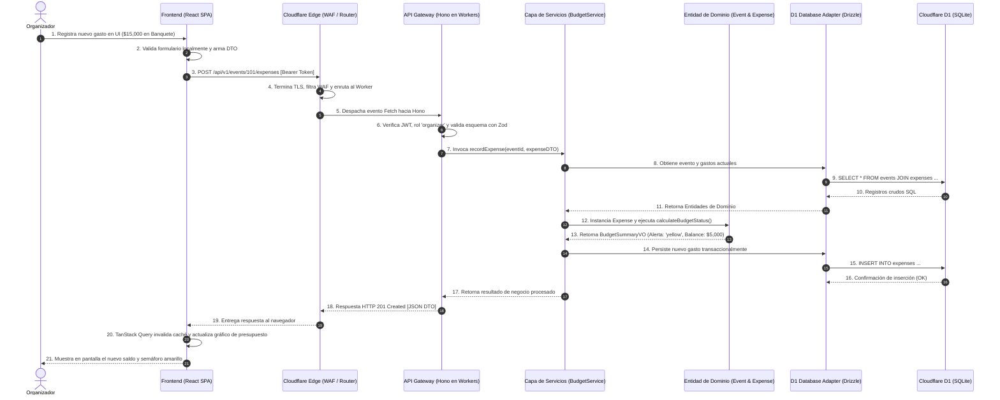
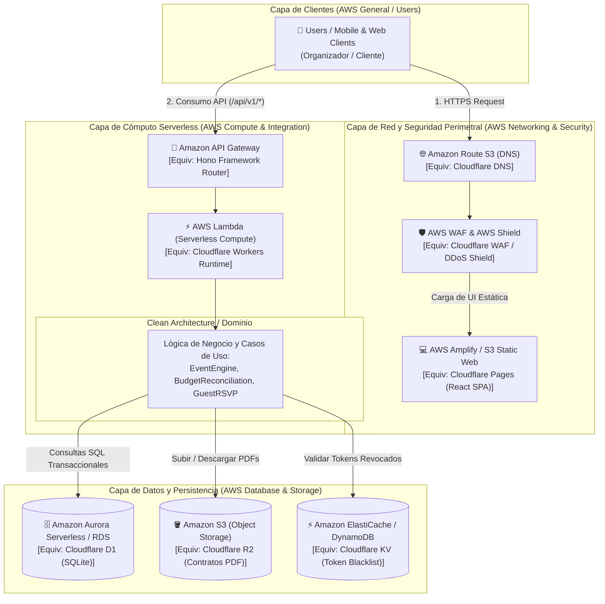
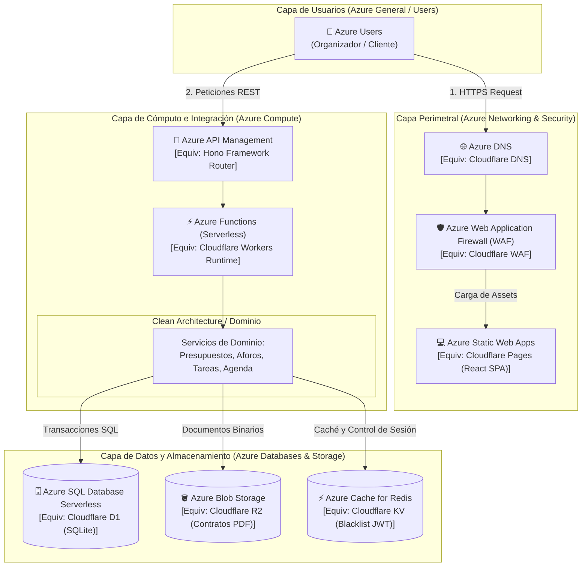

# Arquitectura Lógica del Software — Planora

**Ecosistema Cloud:** Cloudflare Native Edge Ecosystem  
**Patrón Arquitectónico:** Clean Architecture (Puertos y Adaptadores / Arquitectura Hexagonal) adaptada a Edge Runtimes  
**Paradigma:** Monolito Modular en el Borde (*Modular Edge Monolith*), TypeScript End-to-End  
**Principios de Diseño:** Inversión de Dependencias (DIP), Responsabilidad Única (SRP), Separación de Preocupaciones (SoC), Cero Estado en Servidor (*Stateless Compute*)  

---

## 1. Fundamentos y Visión General de la Arquitectura Lógica

La arquitectura lógica de **Planora** ha sido diseñada para desacoplar por completo la interfaz de usuario, la exposición de APIs, la lógica de negocio pura y los mecanismos de persistencia en la nube. 

A diferencia de modelos arquitectónicos convencionales donde la lógica de negocio se mezcla dentro de los controladores de rutas o en consultas directas a la base de datos (*Smart UI* o *Anemic Domain Model*), **Planora** implementa una **Arquitectura Limpia en Capas (Clean Architecture)**:

```text
[ Capa 1: Usuario ]
        ↓
[ Capa 2: Frontend (React SPA) ]
        ↓
[ Capa 3: Cloudflare Edge (DNS / WAF / Router) ]
        ↓
[ Capa 4: API Gateway & Controladores (Hono en Workers) ]
        ↓
[ Capa 5: Servicios de Aplicación & Dominio (Lógica de Negocio) ]
        ↓
[ Capa 6: Persistencia y Almacenamiento (D1, R2, KV via Puertos/Adaptadores) ]
```

### Regla de Dependencia Unidireccional
Las dependencias fluyen estrictamente **hacia adentro**:
- Las entidades del dominio no conocen la existencia de la base de datos (Cloudflare D1), ni del almacenamiento de archivos (Cloudflare R2), ni de HTTP (Hono).
- La capa de aplicación opera sobre **contratos/interfaces (Puertos)**.
- La infraestructura concreta de Cloudflare implementa dichos puertos mediante **Adaptadores**, inyectados en tiempo de ejecución a través de los *Bindings* nativos de Cloudflare Workers.

---

## 2. Diagrama de Arquitectura Lógica Completa (Mermaid)

El siguiente diagrama detalla la jerarquía completa de capas lógicas, los módulos funcionales internos de cada nivel y los límites de responsabilidad:

```mermaid
%%{init: {
  'theme': 'base',
  'themeVariables': {
    'primaryColor': '#ffffff',
    'primaryBorderColor': '#1e293b',
    'primaryTextColor': '#0f172a',
    'lineColor': '#334155',
    'secondaryColor': '#ffffff',
    'tertiaryColor': '#ffffff',
    'mainBkg': '#ffffff',
    'nodeBorder': '#1e293b',
    'nodeTextColor': '#0f172a',
    'clusterBkg': '#ffffff',
    'clusterBorder': '#64748b',
    'clusterTextColor': '#0f172a',
    'titleColor': '#0f172a',
    'edgeLabelBackground': '#ffffff'
  }
}}%%
flowchart TD
    %% ========================================================
    %% CAPA 1: USUARIO
    %% ========================================================
    subgraph Layer1["1. CAPA DE USUARIOS (ACTORES)"]
        OrganizerUser["Organizador de Eventos\n(Wedding Planner / Coordinador Corporativo)"]
        ClientUser["Cliente Anfitrión\n(Novios / Empresa / Festejado)"]
        AdminUser["Administrador de Plataforma\n(Supervisión y Auditoría)"]
    end

    %% ========================================================
    %% CAPA 2: FRONTEND (CLIENTE SPA)
    %% ========================================================
    subgraph Layer2["2. CAPA FRONTEND (CLIENT-SIDE REACT SPA)"]
        subgraph UIViews["Vistas e Interfaz (UI Components)"]
            DashboardView["Dashboard & KPIs View"]
            EventsView["Event Lifecycle & Detail View"]
            BudgetView["Budget & Expense Reconciliation View"]
            GuestsView["Guest List & RSVP Table View"]
            VendorsView["Vendors & Services Catalog View"]
            TasksAgendaView["Tasks Kanban & Agenda Timeline View"]
        end

        subgraph ClientCore["Gestor de Estado y Comunicación"]
            Router["React Router v6\n(Auth Guards & Role RBAC)"]
            QueryCache["TanStack Query (React Query)\n(Server-State Cache & Deduplication)"]
            UIState["Zustand Store\n(Auth Context, Token & Active Session)"]
            APIClient["HTTP Client / Fetch Wrapper\n(JWT Interceptor & Error Boundary)"]
        end

        UIViews --> Router
        Router --> QueryCache
        QueryCache --> UIState
        UIState --> APIClient
    end

    %% ========================================================
    %% CAPA 3: CLOUDFLARE EDGE NETWORK (PERÍMETRO Y ENRUTAMIENTO)
    %% ========================================================
    subgraph Layer3["3. CAPA CLOUDFLARE EDGE (PERÍMETRO GLOBAL ANYCAST)"]
        EdgeDNS["Cloudflare Anycast DNS\n(Resolución global < 10ms)"]
        EdgeSecurity["Cloudflare WAF & DDoS Shield\n(Terminación TLS 1.3 / HTTP/2 & HTTP/3)"]
        EdgeRouter{"Cloudflare Edge Dispatcher\n(Enrutador de Rutas)"}
        
        PagesHost["Cloudflare Pages Host\n(Entrega de Bundles Estáticos SPA)"]
        WorkersRuntime["Cloudflare Workers Runtime\n(V8 Isolates / Cero Arranque en Frío)"]

        EdgeDNS --> EdgeSecurity --> EdgeRouter
        EdgeRouter -->|"Ruta: / o /assets/*"| PagesHost
        EdgeRouter -->|"Ruta: /api/v1/*"| WorkersRuntime
    end

    %% ========================================================
    %% CAPA 4: API GATEWAY Y CONTROLADORES (HONO EN WORKERS)
    %% ========================================================
    subgraph Layer4["4. CAPA DE ENTRADA / API (HONO REST API GATEWAY)"]
        HonoRouter["Hono Framework Router\n(RegExpRouter de Alto Rendimiento)"]

        subgraph MiddlewarePipeline["Pipeline de Middlewares"]
            CorsMw["CORS & Security Headers Middleware"]
            RateLimitMw["Rate Limiter Middleware\n(Protección contra fuerza bruta)"]
            AuthMw["JWT Verification Middleware\n(Web Crypto API)"]
            RbacMw["Role-Based Access Control Guard\n(admin, organizer, client)"]
            ZodMw["Zod Input Validation Middleware\n(Request Body / Params DTOs)"]
            ErrorMw["Global Error Handler & Logger"]
        end

        subgraph Controllers["Controladores REST (Adapters Primarios)"]
            AuthController["AuthController\n(/api/v1/auth)"]
            EventController["EventController\n(/api/v1/events)"]
            BudgetController["BudgetController\n(/api/v1/budget, /expenses)"]
            GuestController["GuestController\n(/api/v1/guests)"]
            VendorController["VendorController\n(/api/v1/vendors, /services)"]
            TaskController["TaskController\n(/api/v1/tasks)"]
            AgendaController["AgendaController\n(/api/v1/agenda)"]
            DashboardController["DashboardController\n(/api/v1/dashboard)"]
        end

        WorkersRuntime --> HonoRouter
        HonoRouter --> CorsMw --> RateLimitMw --> AuthMw --> RbacMw --> ZodMw --> ErrorMw
        ZodMw --> Controllers
    end

    %% ========================================================
    %% CAPA 5: SERVICIOS Y DOMINIO (LÓGICA DE NEGOCIO PURA)
    %% ========================================================
    subgraph Layer5["5. CAPA DE SERVICIOS Y DOMINIO (LÓGICA DE NEGOCIO)"]
        subgraph ApplicationServices["Servicios de Aplicación (Casos de Uso)"]
            AuthService["Auth & Session Service\n(Login, Token Sign, Logout)"]
            EventService["Event Lifecycle Service\n(ConfirmEvent, CancelEvent, Clone)"]
            BudgetService["Budget Engine Service\n(CalculateStatus, OverrunAlert, Reconcile)"]
            GuestService["Guest & RSVP Service\n(RegisterRsvp, AssignTableCapacity)"]
            VendorService["Vendor & Contract Service\n(ContractService, SignDocument)"]
            TaskService["Task Operation Service\n(CompleteTask, CalculateProgress)"]
            AgendaService["Timeline Schedule Service\n(ReorderTimeline, DetectConflicts)"]
            DashboardService["Dashboard Aggregator Service\n(CalculateKPIs, EventDeepSummary)"]
        end

        subgraph DomainCore["Núcleo del Dominio (Pure Domain Core)"]
            Entities["Entidades de Negocio:\nEvent, Guest, Expense, Vendor, Task, AgendaItem"]
            ValueObjects["Value Objects Inmutables:\nBudgetSummaryVO, RsvpStatusVO, TimeIntervalVO"]
            DomainRules["Reglas de Invarianza:\nValidación de Fechas, Aforo Máximo de Mesas, Límite de Gasto"]
        end

        subgraph Ports["Puertos del Dominio (Interfaces Abstraídas)"]
            IRepoEvents["IEventRepository"]
            IRepoBudget["IExpenseRepository"]
            IRepoGuests["IGuestRepository"]
            IRepoVendors["IVendorRepository"]
            IRepoTasks["ITaskRepository"]
            IRepoAgenda["IAgendaRepository"]
            IFileStorage["IFileStoragePort"]
            ICachePort["ICacheSessionPort"]
        end

        Controllers --> ApplicationServices
        ApplicationServices --> DomainCore
        ApplicationServices --> Ports
    end

    %% ========================================================
    %% CAPA 6: PERSISTENCIA Y ALMACENAMIENTO (ADAPTADORES DE INFRAESTRUCTURA)
    %% ========================================================
    subgraph Layer6["6. CAPA DE PERSISTENCIA Y ALMACENAMIENTO (CLOUDFLARE ADAPTERS)"]
        subgraph InfrastructureAdapters["Adaptadores Secundarios (Infraestructura)"]
            DrizzleAdapter["Drizzle ORM Adapter\n(Implementa IRepositories mediante SQL Tipado)"]
            R2StorageAdapter["Cloudflare R2 Adapter\n(Implementa IFileStoragePort para PDFs y Comprobantes)"]
            KVStorageAdapter["Cloudflare KV Adapter\n(Implementa ICacheSessionPort para Blacklist y RateLimit)"]
        end

        subgraph CloudflareResources["Recursos Persistentes de Cloudflare"]
            D1Engine[("Cloudflare D1 Database\nMotor SQLite Transaccional Serverless\nBinding: env.DB")]
            R2Engine[("Cloudflare R2 Object Storage\nAlmacén de Objetos S3 Sin Costos de Egress\nBinding: env.STORAGE")]
            KVEngine[("Cloudflare KV Store\nAlmacén Clave-Valor Distribuido en Memoria\nBinding: env.KV_CACHE")]
        end

        IRepoEvents & IRepoBudget & IRepoGuests & IRepoVendors & IRepoTasks & IRepoAgenda --> DrizzleAdapter
        IFileStorage --> R2StorageAdapter
        ICachePort --> KVStorageAdapter

        DrizzleAdapter -->|"Consultas SQL Transaccionales"| D1Engine
        R2StorageAdapter -->|"PutObject / GetSignedUrl"| R2Engine
        KVStorageAdapter -->|"Get / Put con TTL"| KVEngine
    end

    %% ========================================================
    %% RELACIONES ENTRE CAPAS SUPERIORES
    %% ========================================================
    OrganizerUser & ClientUser & AdminUser -->|"Interactúa con UI"| UIViews
    APIClient -->|"Petición HTTPS / JSON"| EdgeDNS
    PagesHost -.->|"Descarga inicial de Assets"| UIViews
```



---

## 3. Desglose Detallado de Capas Lógicas y Responsabilidades

### 3.1 Capa 1: Usuario y Actores
Representa a los consumidores directos de la solución. Cada actor cuenta con un contexto delimitado (*Bounded Context*) dentro del sistema:
- **Organizador:** Ejecuta casos de uso administrativos, financieros, contractuales y logísticos completos.
- **Cliente:** Consume vistas restringidas de su evento específico, interactúa con la confirmación de invitados y consulta el cronograma en tiempo real.
- **Administrador:** Acceso a métricas de auditoría global del sistema y supervisión técnica.

---

### 3.2 Capa 2: Frontend (Client-Side Presentation Layer)
Construida como una Single Page Application (SPA) sobre React 18 y TypeScript, optimizada para ejecutarse en el navegador del usuario:
1. **Componentes Visuales (UI Views):** Interfaces modulares construidas con Tailwind CSS que representan los módulos del negocio (Dashboard, Eventos, Finanzas, Invitados, Tareas, Cronograma).
2. **React Router v6:** Controla la navegación en el cliente, evaluando guardias de autenticación (*AuthGuards*) y permisos según el rol almacenado en el token.
3. **TanStack Query (React Query):** Administra el estado asíncrono del servidor en el cliente. Proporciona caché en memoria, deduplicación de peticiones, reintentos automáticos y actualización optimista de datos en pantalla.
4. **Zustand Store:** Almacén de estado global ligero para datos de sesión efímeros (usuario activo, token JWT, preferencias visuales).
5. **Cliente HTTP Tipado:** Capa de abstracción sobre la Fetch API nativa que inyecta automáticamente el encabezado `Authorization: Bearer <token>`, intercepta respuestas 401 para expiración de sesión y deserializa los DTOs fuertemente tipados generados por la API.

---

### 3.3 Capa 3: Perímetro Cloudflare Edge (Red y Distribución)
La infraestructura distribuida de Cloudflare actúa como la primera línea de procesamiento y enrutamiento en el borde:
1. **Anycast DNS:** Resuelve la dirección IP del usuario hacia el centro de datos de Cloudflare más cercano físicamente (<10 ms).
2. **WAF & DDoS Shield:** Filtra tráfico malicioso, mitiga ataques distribuidos de denegación de servicio e implementa terminación TLS 1.3 con certificados automáticos.
3. **Cloudflare Edge Dispatcher:**
   - Si la ruta solicitada corresponde a la aplicación web (`/`, `/assets/*`, `/favicon.ico`), sirve los archivos precompilados en caché global desde **Cloudflare Pages**.
   - Si la ruta comienza con `/api/v1/*`, despacha la solicitud directamente hacia el runtime de **Cloudflare Workers**.

---

### 3.4 Capa 4: API Gateway y Controladores (Cloudflare Workers + Hono)
El backend corre en Cloudflare Workers utilizando el microframework **Hono** para ofrecer enrutamiento ultrarrápido y seguro:
1. **Pipeline de Middlewares:**
   - `CorsMiddleware`: Restringe orígenes cruzados permitidos y cabeceras seguras.
   - `RateLimiterMiddleware`: Consulta Cloudflare KV para limitar solicitudes sospechosas por IP.
   - `AuthMiddleware`: Extrae el token JWT, valida su firma criptográfica con Web Crypto API y consulta Cloudflare KV para garantizar que no esté revocado.
   - `RbacGuard`: Valida que el rol del usuario coincida con la política requerida por el endpoint (`admin`, `organizer`, `client`).
   - `ZodValidationMiddleware`: Parsea y sanitiza la carga útil entrante (*body*, *query params*); si los datos no cumplen el contrato DTO, rechaza la solicitud de inmediato con HTTP 400 antes de tocar la lógica de negocio.
   - `GlobalErrorHandler`: Atrapa excepciones de dominio y las traduce a respuestas JSON estandarizadas (código de error, mensaje descriptivo, timestamp).
2. **Controladores REST:** Mapean las rutas HTTP a las invocaciones de los Servicios de Aplicación correspondientes. No contienen lógica de negocio; solo transforman DTOs de entrada y devuelven respuestas HTTP estructuradas.

---

### 3.5 Capa 5: Servicios de Aplicación y Núcleo del Dominio (Business Logic Layer)
Esta capa es el corazón intelectual de **Planora**. Es código TypeScript puro, sin dependencias de frameworks web ni de controladores HTTP:
1. **Servicios de Aplicación (Casos de Uso):**
   - Orquestan el flujo de datos.
   - Ejemplo: `BudgetService.recordExpense()` recibe el DTO, instancia la entidad `Expense`, invoca el método de dominio `isOverdue()`, lo persiste mediante `IExpenseRepository`, recalcula el balance mediante `calculateBudgetStatus()` y emite una alerta si se detecta sobrecosto.
2. **Entidades del Dominio y Value Objects:**
   - Modela las reglas fundamentales de la empresa:
     - `Event`: controla el ciclo de vida y la coherencia de estados.
     - `Guest`: aplica reglas de restricción de aforo de mesas.
     - `BudgetSummaryVO`: objeto de valor inmutable que encapsula `initialBudget`, `totalSpent`, `remainingBalance` y `statusAlert`.
3. **Puertos del Dominio (Ports):**
   - Interfaces TypeScript (`IEventRepository`, `IExpenseRepository`, `IFileStoragePort`, `ICacheSessionPort`) que declaran qué operaciones necesita el dominio sin saber cómo están implementadas técnicamente.

---

### 3.6 Capa 6: Persistencia y Almacenamiento (Adaptadores Cloudflare)
Implementa los Puertos del dominio conectándose a los recursos físicos de Cloudflare:
1. **Drizzle ORM Adapter (para Cloudflare D1):**
   - Implementa los repositorios relacionales.
   - Ejecuta consultas SQL seguras mediante el binding `env.DB`.
   - Garantiza transacciones ACID para operaciones críticas como cancelaciones en cascada o contrataciones.
2. **Cloudflare R2 Storage Adapter:**
   - Implementa `IFileStoragePort`.
   - Interactúa con el bucket `planora-assets-prod` mediante el binding `env.STORAGE` para almacenar contratos PDF y comprobantes digitales sin costos de salida (*zero egress fees*).
3. **Cloudflare KV Session Adapter:**
   - Implementa `ICacheSessionPort`.
   - Registra identificadores de tokens revocados con expiración TTL automática mediante el binding `env.KV_CACHE`.

---

## 4. Flujo Lógico de Procesamiento de Peticiones (End-to-End)

A continuación se ilustra la secuencia exacta en que viajan los datos a través de las 6 capas cuando un usuario ejecuta una acción crítica de negocio (por ejemplo, registrar un gasto y conciliar el presupuesto):



## 5. Homologación y Mapeo Conceptual para Diagramación (AWS & Azure Icons)

Para la entrega académica y la presentación final del proyecto, se homologa la arquitectura nativa de Cloudflare con las dos bibliotecas estándar de la industria indicadas por la cátedra universitaria:
- [Página de íconos de arquitectura de AWS (amazon.com)](https://aws.amazon.com/es/architecture/icons/)
- [Iconos de Azure - Azure Architecture Center | Microsoft Learn](https://learn.microsoft.com/es-es/azure/architecture/icons/)

### 5.1 Matriz de Homologación Tecnológica y Visual

Esta tabla permite al estudiante diagramar la solución en **Draw.io**, **Lucidchart**, **PowerPoint** o **Visio** utilizando tanto los íconos oficiales de AWS como los de Azure:

| Componente Lógico (Planora) | Recurso Real de Ejecución (Cloudflare) | Equivalente / Ícono Oficial AWS (AWS Architecture Icons) | Equivalente / Ícono Oficial Azure (Azure Architecture Icons) | Función Arquitectónica |
|---|---|---|---|---|
| **Capa de Usuarios / Actores** | Navegadores Web y Dispositivos Móviles | `General / Users` o `Client` | `General / Users` | Representa a organizadores, clientes y administradores interactuando con la interfaz. |
| **Alojamiento Frontend (SPA)** | **Cloudflare Pages** | `AWS Amplify` o `Amazon S3 (Static Web)` | `Azure Static Web Apps` | Aloja y distribuye globalmente los bundles compilados de React 18 + Vite. |
| **Sistema DNS y Enrutamiento Global** | **Cloudflare Anycast DNS** | `Amazon Route 53` | `Azure DNS` | Resolución de nombres con latencia mínima hacia el nodo de borde más cercano. |
| **Seguridad de Borde (WAF & DDoS)** | **Cloudflare WAF & DDoS Shield** | `AWS WAF` & `AWS Shield` | `Azure Web Application Firewall (WAF)` | Filtrado perimetral contra ataques web, mitigación DDoS y terminación TLS 1.3. |
| **API Gateway & Enrutador REST** | **Hono Router (en Workers)** | `Amazon API Gateway` | `Azure API Management` | Despacho de rutas `/api/v1/*`, CORS, rate limiting y validación de esquemas Zod. |
| **Cómputo Serverless Backend** | **Cloudflare Workers (V8 Isolates)** | `AWS Lambda` | `Azure Functions` | Cómputo serverless de 0 ms cold start donde corren los controladores y servicios de dominio. |
| **Base de Datos Transaccional** | **Cloudflare D1 (SQLite Edge)** | `Amazon Aurora Serverless` / `Amazon RDS` | `Azure SQL Database Serverless` | Motor relacional SQL con transacciones ACID para usuarios, eventos, tareas y gastos. |
| **Almacenamiento de Archivos (Objetos)** | **Cloudflare R2 (S3-compatible)** | `Amazon Simple Storage Service (Amazon S3)` | `Azure Blob Storage` | Repositorio de objetos para comprobantes de pago y contratos PDF sin costos de egress. |
| **Caché y Almacén Clave-Valor** | **Cloudflare KV** | `Amazon ElastiCache` o `Amazon DynamoDB (KV)` | `Azure Cache for Redis` o `Azure Table Storage` | Almacenamiento en memoria ultra rápido para revocación de JWT y control de cuotas. |

---

## 6. Diagramas de Arquitectura con Taxonomía de Íconos Universitaria

### 6.1 Diagrama de Arquitectura con Homologación AWS Icons (Mermaid)



---

### 6.2 Diagrama de Arquitectura con Homologación Azure Icons (Mermaid)



---

## 7. Guía Paso a Paso para Diagramar en Draw.io o Lucidchart

Para los entregables gráficos solicitados por el profesor en la universidad:

### Paso 1: Configurar la Biblioteca de Íconos en Draw.io / Lucidchart
- **En Draw.io:** Clic en `Más formas` (abajo a la izquierda) $\rightarrow$ Activar la casilla `AWS 2024` o `Azure`.
- **En Lucidchart:** Clic en `+ Figuras` $\rightarrow$ Buscar e importar `AWS Architecture` o `Azure Cloud Architecture`.

### Paso 2: Dibujar los Cuadros Delimitadores (*Bounding Boxes*)
1. **Lado Izquierdo:** Caja agrupada llamada `Client Tier` con el ícono `Users`.
2. **Centro Superior:** Caja agrupada llamada `Edge Perimeter Tier` con los íconos de DNS, WAF y Static Web Hosting (`Amplify` / `Static Web Apps`).
3. **Centro:** Caja agrupada llamada `Serverless Compute Tier` con el ícono de API Gateway (`Amazon API Gateway` / `Azure API Management`) conectado al ícono de Serverless Compute (`AWS Lambda` / `Azure Functions`).
4. **Lado Derecho:** Caja agrupada llamada `Data & Storage Tier` conteniendo los 3 íconos de persistencia:
   - Base de Datos Relacional (`Aurora Serverless` / `Azure SQL`).
   - Almacén de Objetos (`Amazon S3` / `Azure Blob Storage`).
   - Caché en Memoria (`ElastiCache` / `Azure Cache for Redis`).

### Paso 3: Rotulación y Claridad Técnica para Evaluación Docente
En cada figura, colocar una etiqueta doble que demuestre la relación de homologación técnica:
> *Ejemplo de etiqueta en el ícono de Lambda:*  
> **AWS Lambda**  
> *(Ejecutado en Cloudflare Workers / Hono API)*  
>  
> *Ejemplo de etiqueta en el ícono de S3:*  
> **Amazon S3**  
> *(Ejecutado en Cloudflare R2 Object Storage)*

---

## 8. Justificación de Decisiones de Arquitectura Lógica

1. **¿Por qué Puertos y Adaptadores (Clean Architecture) en un Edge Monolith?**  
   Permite que la lógica de negocio (fórmulas de presupuesto, cálculos de aforo, transiciones de eventos) sea **100% testeable de forma aislada con Vitest**, sin necesidad de conectarse a bases de datos en la nube ni simular la red.
2. **¿Por qué Hono en lugar de Express o NestJS?**  
   Express y NestJS fueron concebidos para servidores Node.js permanentes con sockets TCP tradicionales y ocupan más de 30 MB en memoria. Hono fue diseñado específicamente para la API de Web Standards (`Request`/`Response`) de los V8 Isolates de Cloudflare Workers, pesa menos de 15 KB y compila con latencia de ejecución prácticamente nula.
3. **¿Por qué Bindings de Cloudflare en lugar de conexiones TCP estándar?**  
   Cloudflare Workers inyecta los recursos (D1, R2, KV) en el contexto de ejecución del proceso (`env`). Esto elimina la sobrecarga de negociación de conexiones TCP (*TCP handshake/SSL handshake*), evitando cuellos de botella y fugas de contraseñas de conexión.

