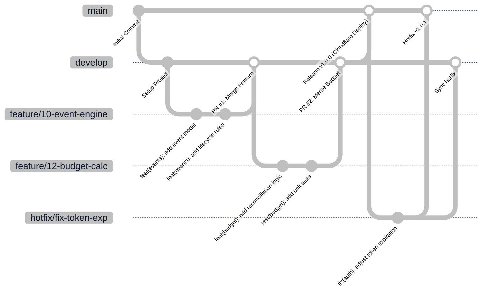

# Estrategia de Ramas Git y Flujo de Trabajo — Planora

**Modelo de Ramas:** Git Flow Adaptado / GitHub Flow Estructurado  
**Convención de Mensajes:** Conventional Commits v1.0.0  
**Políticas de Integración:** Pull Requests obligatorios con validación CI por estatus (*Status Checks*)  

---

## 1. Evaluación y Selección del Modelo de Ramas

Para un proyecto individual de 9º semestre en la asignatura de *Infraestructura para el Desarrollo Continuo*, se evaluaron tres modelos:
1. **GitHub Flow Simple (Solo `main` + `feature/*`):** Muy simple, pero mezcla el código recién integrado con el estado productivo en vivo. No permite simular entornos de *Staging* vs. *Producción*.
2. **Git Flow Tradicional (`main`, `develop`, `feature/*`, `release/*`, `hotfix/*`):** Diseñado para grandes equipos corporativos con ciclos de entrega mensuales; las ramas `release/*` agregan sobrecarga innecesaria para un único desarrollador.
3. **Git Flow Adaptado y Pragmático *(Seleccionado)*:**  
   Mantiene dos ramas troncales protegidas (`main` y `develop`) complementadas con ramas efímeras de trabajo (`feature/*`, `fix/*`, `hotfix/*`). Combina el máximo rigor profesional con agilidad operativa.

---

## 2. Tipología y Ciclo de Vida de las Ramas



### 2.1 Definición de Ramas

| Nombre de Rama | Propósito | Rama Origen | Rama Destino de Merge | Despliegue Automatizado |
|----------------|-----------|-------------|-----------------------|-------------------------|
| `main` | **Producción Estable.** Código auditado y validado que se ejecuta en vivo para usuarios finales. | Ninguna (inicial) | Ninguna | Despliegue a Producción en Cloudflare + Publicación en Docker Hub con tag `latest`. |
| `develop` | **Integración y Staging.** Punto de convergencia donde se integran todas las características listas para validación conjunta. | `main` | `main` | Ejecuta tests de integración y pre-build. |
| `feature/<id>-<slug>` | **Nuevas Características.** Desarrollo de una funcionalidad específica ligada a un Issue del Project Board. | `develop` | `develop` (vía PR) | Ejecuta pruebas unitarias y verificación de tipos (CI). |
| `fix/<id>-<slug>` | **Corrección de Defectos.** Solución de bugs detectados durante pruebas en la rama `develop`. | `develop` | `develop` (vía PR) | Ejecuta pruebas unitarias y regresión (CI). |
| `hotfix/<id>-<slug>` | **Parche Crítico de Producción.** Correcciones urgentes de incidentes en vivo sobre `main`. | `main` | `main` y sincronizado a `develop` | Despliegue inmediato a Producción con parche de versión SemVer. |

---

## 3. Convenciones de Nomenclatura

### 3.1 Nombres de Ramas
El nombre debe incluir el número del Issue del backlog y una descripción breve en kebab-case:
```text
feature/ISSUE_ID-descripcion-corta
fix/ISSUE_ID-descripcion-corta
hotfix/ISSUE_ID-descripcion-corta

# Ejemplos reales:
feature/04-auth-jwt-cloudflare-kv
feature/07-event-crud-operations
feature/11-budget-calculation-engine
fix/22-rsvp-counter-boundary-check
hotfix/29-cors-header-patch
```

### 3.2 Convención de Mensajes de Commit (Conventional Commits)
Se adopta el estándar de [Conventional Commits v1.0.0](https://www.conventionalcommits.org/):

```text
<tipo>(<alcance opcional>): <descripción imperativa en presente> [#ISSUE_ID]

[cuerpo explicativo opcional]

[pie de commit opcional: BREAKING CHANGE o referencias]
```

#### Tipos de Commits Permitidos:
- `feat:` Nueva funcionalidad o método de negocio.
- `fix:` Corrección de un defecto o bug.
- `test:` Inclusión o refactorización de pruebas unitarias (Vitest).
- `docs:` Modificaciones en documentación Markdown o diagramas.
- `ci:` Cambios en pipelines de GitHub Actions o scripts de Docker.
- `refactor:` Modificación de código que no altera el comportamiento funcional ni corrige bugs.
- `chore:` Tareas rutinarias de configuración, dependencias o herramientas.

#### Ejemplos Válidos:
```text
feat(budget): implementar metodo calculateBudgetStatus con alertas de color #11
test(events): agregar casos de prueba para confirmacion con fecha retroactiva #08
fix(guests): validar que plusOnes no exceda aforo de mesa #22
ci(docker): agregar configuracion multi-stage para reduccion de imagen #15
docs(architecture): actualizar diagrama de infraestructura Cloudflare en Mermaid #02
```

---

## 4. Políticas de Pull Requests y Merge

1. **Protección de Ramas:**
   - Se prohíbe el `git push --force` directo sobre `main` y `develop`.
   - Toda integración a `develop` o `main` debe originarse obligatoriamente mediante un **Pull Request**.
2. **Requisitos de Integración Continua (Branch Protection Rules):**
   - El pipeline de GitHub Actions debe reportar `passed` en:
     - Verificación estática de tipos (`npm run typecheck`).
     - Análisis de linter (`npm run lint`).
     - Suite completa de pruebas unitarias con Vitest (`npm run test`).
3. **Estrategia de Merge:**
   - Para integrar `feature/*` a `develop`: Se utiliza **Squash and Merge** para mantener una línea de tiempo lineal y limpia en la rama de integración.
   - Para integrar `develop` a `main`: Se utiliza **Merge Commit** explícito con tag de versión (e.g., `v1.0.0`), documentando la entrega formal (*release*).
