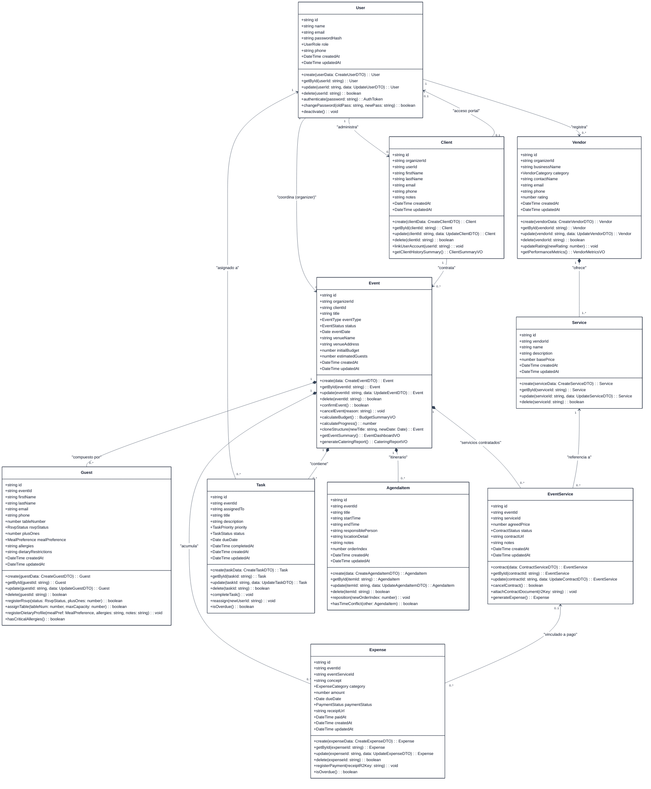

# Diagrama de Clases UML — Planora

Este documento presenta el diseño orientado a objetos del dominio de **Planora**. El modelo refleja fielmente la lógica de negocio, las operaciones de persistencia (CRUD) y los métodos especializados requeridos para la gestión profesional de eventos.

---

## 1. Diagrama de Clases Completo (Mermaid UML)

---

## 2. Explicación de Clases y Métodos de Negocio

El modelo de clases no se limita a operaciones de acceso a datos (*Active Record* o getters/setters pasivos); encapsula la lógica medular del negocio conforme a los principios de diseño de software orientado a objetos y *Domain-Driven Design (DDD)*:

### 2.1 Clase `Event`
- **Responsabilidad Central:** Es el agregado raíz (*Aggregate Root*) de la gestión operativa.
- **Métodos de Negocio Destacados:**
  - `confirmEvent()`: Evalúa que existan condiciones mínimas (cliente asignado, fecha en el futuro y presupuesto base registrado) para avanzar el estado a `confirmed`.
  - `cancelEvent(reason)`: Ejecuta una desactivación ordenada; suspende tareas activas y marca contrataciones de servicios pendientes en estado `cancelled`.
  - `calculateBudget()`: Invoca la suma agregada de la colección de `Expense` para emitir un objeto inmutable de valor (`BudgetSummaryVO`) con presupuesto asignado, gastado, comprometido y disponible.
  - `calculateProgress()`: Retorna un porcentaje numérico del 0 al 100 calculado a partir de la razón entre tareas en estado `completed` sobre el total de tareas operativas registradas.
  - `cloneStructure(newTitle, newDate)`: Implementa el patrón *Prototype*; toma las tareas y la estructura del cronograma de un evento exitoso para inicializar uno nuevo ahorrando tiempo de configuración al organizador.

### 2.2 Clase `Guest`
- **Responsabilidad:** Gestión de confirmación de asistencia y control de aforo por mesa.
- **Métodos de Negocio Destacados:**
  - `registerRsvp(status, plusOnes)`: Controla que los acompañantes no superen el límite establecido y actualiza la confirmación de asistencia.
  - `assignTable(tableNum, maxCapacity)`: Verifica que la suma de invitados sentados previamente en `tableNum` más este invitado y sus `plusOnes` no exceda la capacidad máxima por mesa.

### 2.3 Clase `EventService`
- **Responsabilidad:** Representa el contrato vinculante entre el organizador y el proveedor para un evento dado.
- **Métodos de Negocio Destacados:**
  - `attachContractDocument(r2Key)`: Vincula la llave del archivo almacenado en Cloudflare R2 con el contrato legal.
  - `generateExpense()`: Automatiza la creación de un objeto `Expense` para asegurar que todo servicio contratado se refleje inmediatamente en el balance presupuestario del evento.

### 2.4 Clase `Expense`
- **Responsabilidad:** Trazabilidad de desembolsos monetarios y cuentas por pagar.
- **Métodos de Negocio Destacados:**
  - `registerPayment(receiptR2Key)`: Cambia el estado a `paid`, vincula el comprobante digital subido a Cloudflare R2 y sella la fecha de ejecución.
  - `isOverdue()`: Compara la fecha de vencimiento (`dueDate`) con la fecha actual cuando el estado es `pending`.

### 2.5 Clase `Task` y `AgendaItem`
- **Responsabilidad:** Coordinación temporal previa (pre-producción) y durante el día del evento (producción en vivo).
- **Métodos de Negocio Destacados:**
  - `completeTask()`: Marca la tarea como finalizada y sella `completedAt`.
  - `hasTimeConflict(other: AgendaItem)`: Detecta solapamientos horarios en la misma locación o con la misma persona responsable, evitando choques en el itinerario de la fiesta.
