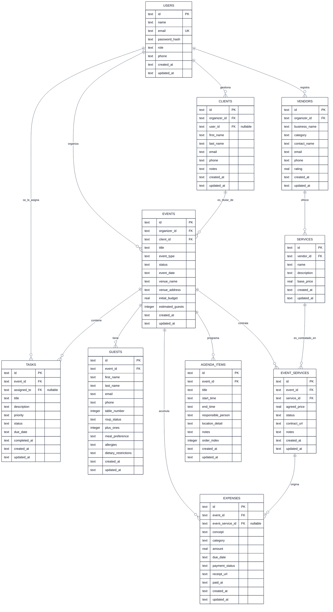

# Modelo de Datos Relacional — Planora (Cloudflare D1 / SQLite)

**Motor de Base de Datos:** Cloudflare D1 (Motor SQLite distribuido en el Edge)  
**Herramienta de Mapeo:** Drizzle ORM (TypeScript-first, zero-overhead, compatible nativo con D1)  
**Estrategia de Llaves:** Identificadores únicos basados en UUID v4 generados en la capa de aplicación o via SQLite `text` primary keys.  

---

## 1. Diagrama Entidad-Relación (Mermaid ERD)



---

## 2. Explicación de Cardinalidades y Normalización

1. **Relación Organizador - Clientes (1:N):**
   - Un usuario con rol `organizer` puede registrar y gestionar múltiples clientes (`1:N`).
   - Un cliente pertenece a un único organizador dentro de la plataforma para mantener aislamiento de datos entre organizadores.
2. **Relación Cliente - Portal de Usuario (1:1 Opcional):**
   - Un cliente puede o no tener acceso al portal web. Si se le habilita una cuenta, el campo `user_id` en `clients` apunta de manera única a la tabla `users` (`1:1`).
3. **Relación Cliente - Eventos (1:N):**
   - Un cliente puede contratar uno o varios eventos con el tiempo (e.g., una boda y posteriormente una fiesta de aniversario) (`1:N`).
   - Todo evento está vinculado a un cliente titular obligatorio (`N:1`).
4. **Relación Evento - Invitados (1:N):**
   - Un evento tiene una lista de asistentes asociados. Si se elimina el evento, se eliminan sus invitados en cascada (`ON DELETE CASCADE`).
5. **Relación Proveedores - Servicios (1:N):**
   - Un proveedor comercial ofrece un catálogo de uno o más servicios estándar (e.g., "Paquete Básico", "Paquete Platino") (`1:N`).
6. **Relación Eventos - Servicios (N:M a través de `event_services`):**
   - Un evento contrata múltiples servicios, y un servicio puede ser contratado en múltiples eventos a lo largo del tiempo.
   - La tabla asociativa `event_services` materializa esta relación muchos a muchos y contiene atributos de negociación específicos: `agreed_price`, `status`, `contract_url` y `notes`.
7. **Relación Evento / Contratación - Gastos (1:N):**
   - Todo gasto pertenece obligatoriamente a un evento (`1:N`).
   - Opcionalmente, un gasto puede estar ligado a un servicio contratado específico (`event_services`), lo que permite saber qué porcentaje del contrato del proveedor ya ha sido liquidado.
8. **Relación Evento - Tareas (1:N):**
   - Un evento cuenta con su propio listado de tareas operativas (`1:N`). Cada tarea puede estar asignada opcionalmente a un miembro del equipo (`assigned_to -> users.id`).
9. **Relación Evento - Agenda / Cronograma (1:N):**
   - Un evento posee múltiples bloques temporales secuenciales que forman el itinerario del día (`1:N`), ordenados por `order_index`.

---

## 3. Diccionario de Datos DDL (SQL para Cloudflare D1)

```sql
-- Habilitar soporte de llaves foráneas en SQLite/D1
PRAGMA foreign_keys = ON;

-- 1. TABLA: users
CREATE TABLE IF NOT EXISTS users (
    id TEXT PRIMARY KEY,
    name TEXT NOT NULL,
    email TEXT NOT NULL UNIQUE,
    password_hash TEXT NOT NULL,
    role TEXT NOT NULL CHECK (role IN ('admin', 'organizer', 'client')),
    phone TEXT,
    created_at TEXT NOT NULL DEFAULT (strftime('%Y-%m-%dT%H:%M:%fZ', 'now')),
    updated_at TEXT NOT NULL DEFAULT (strftime('%Y-%m-%dT%H:%M:%fZ', 'now'))
);

CREATE INDEX IF NOT EXISTS idx_users_email ON users(email);
CREATE INDEX IF NOT EXISTS idx_users_role ON users(role);

-- 2. TABLA: clients
CREATE TABLE IF NOT EXISTS clients (
    id TEXT PRIMARY KEY,
    organizer_id TEXT NOT NULL,
    user_id TEXT UNIQUE,
    first_name TEXT NOT NULL,
    last_name TEXT NOT NULL,
    email TEXT NOT NULL,
    phone TEXT NOT NULL,
    notes TEXT,
    created_at TEXT NOT NULL DEFAULT (strftime('%Y-%m-%dT%H:%M:%fZ', 'now')),
    updated_at TEXT NOT NULL DEFAULT (strftime('%Y-%m-%dT%H:%M:%fZ', 'now')),
    FOREIGN KEY (organizer_id) REFERENCES users(id) ON DELETE RESTRICT,
    FOREIGN KEY (user_id) REFERENCES users(id) ON DELETE SET NULL
);

CREATE INDEX IF NOT EXISTS idx_clients_organizer ON clients(organizer_id);
CREATE INDEX IF NOT EXISTS idx_clients_email ON clients(email);

-- 3. TABLA: events
CREATE TABLE IF NOT EXISTS events (
    id TEXT PRIMARY KEY,
    organizer_id TEXT NOT NULL,
    client_id TEXT NOT NULL,
    title TEXT NOT NULL,
    event_type TEXT NOT NULL CHECK (event_type IN ('wedding', 'fifteen_years', 'corporate', 'graduation', 'social')),
    status TEXT NOT NULL DEFAULT 'draft' CHECK (status IN ('draft', 'planning', 'confirmed', 'in_progress', 'completed', 'cancelled')),
    event_date TEXT NOT NULL,
    venue_name TEXT NOT NULL,
    venue_address TEXT,
    initial_budget REAL NOT NULL DEFAULT 0.0 CHECK (initial_budget >= 0.0),
    estimated_guests INTEGER NOT NULL DEFAULT 0 CHECK (estimated_guests >= 0),
    created_at TEXT NOT NULL DEFAULT (strftime('%Y-%m-%dT%H:%M:%fZ', 'now')),
    updated_at TEXT NOT NULL DEFAULT (strftime('%Y-%m-%dT%H:%M:%fZ', 'now')),
    FOREIGN KEY (organizer_id) REFERENCES users(id) ON DELETE RESTRICT,
    FOREIGN KEY (client_id) REFERENCES clients(id) ON DELETE RESTRICT
);

CREATE INDEX IF NOT EXISTS idx_events_organizer ON events(organizer_id);
CREATE INDEX IF NOT EXISTS idx_events_client ON events(client_id);
CREATE INDEX IF NOT EXISTS idx_events_date ON events(event_date);
CREATE INDEX IF NOT EXISTS idx_events_status ON events(status);

-- 4. TABLA: guests
CREATE TABLE IF NOT EXISTS guests (
    id TEXT PRIMARY KEY,
    event_id TEXT NOT NULL,
    first_name TEXT NOT NULL,
    last_name TEXT NOT NULL,
    email TEXT,
    phone TEXT,
    table_number INTEGER,
    rsvp_status TEXT NOT NULL DEFAULT 'pending' CHECK (rsvp_status IN ('pending', 'confirmed', 'declined')),
    plus_ones INTEGER NOT NULL DEFAULT 0 CHECK (plus_ones >= 0),
    meal_preference TEXT NOT NULL DEFAULT 'standard' CHECK (meal_preference IN ('standard', 'vegetarian', 'vegan', 'child', 'kosher', 'other')),
    allergies TEXT,
    dietary_restrictions TEXT,
    created_at TEXT NOT NULL DEFAULT (strftime('%Y-%m-%dT%H:%M:%fZ', 'now')),
    updated_at TEXT NOT NULL DEFAULT (strftime('%Y-%m-%dT%H:%M:%fZ', 'now')),
    FOREIGN KEY (event_id) REFERENCES events(id) ON DELETE CASCADE
);

CREATE INDEX IF NOT EXISTS idx_guests_event ON guests(event_id);
CREATE INDEX IF NOT EXISTS idx_guests_rsvp ON guests(rsvp_status);
CREATE INDEX IF NOT EXISTS idx_guests_table ON guests(event_id, table_number);
CREATE INDEX IF NOT EXISTS idx_guests_meal ON guests(event_id, meal_preference);

-- 5. TABLA: vendors
CREATE TABLE IF NOT EXISTS vendors (
    id TEXT PRIMARY KEY,
    organizer_id TEXT NOT NULL,
    business_name TEXT NOT NULL,
    category TEXT NOT NULL CHECK (category IN ('catering', 'photography', 'music_dj', 'venue', 'decoration', 'flowers', 'security', 'transport', 'other')),
    contact_name TEXT NOT NULL,
    email TEXT NOT NULL,
    phone TEXT NOT NULL,
    rating REAL NOT NULL DEFAULT 5.0 CHECK (rating >= 1.0 AND rating <= 5.0),
    created_at TEXT NOT NULL DEFAULT (strftime('%Y-%m-%dT%H:%M:%fZ', 'now')),
    updated_at TEXT NOT NULL DEFAULT (strftime('%Y-%m-%dT%H:%M:%fZ', 'now')),
    FOREIGN KEY (organizer_id) REFERENCES users(id) ON DELETE RESTRICT
);

CREATE INDEX IF NOT EXISTS idx_vendors_organizer ON vendors(organizer_id);
CREATE INDEX IF NOT EXISTS idx_vendors_category ON vendors(category);

-- 6. TABLA: services
CREATE TABLE IF NOT EXISTS services (
    id TEXT PRIMARY KEY,
    vendor_id TEXT NOT NULL,
    name TEXT NOT NULL,
    description TEXT,
    base_price REAL NOT NULL DEFAULT 0.0 CHECK (base_price >= 0.0),
    created_at TEXT NOT NULL DEFAULT (strftime('%Y-%m-%dT%H:%M:%fZ', 'now')),
    updated_at TEXT NOT NULL DEFAULT (strftime('%Y-%m-%dT%H:%M:%fZ', 'now')),
    FOREIGN KEY (vendor_id) REFERENCES vendors(id) ON DELETE CASCADE
);

CREATE INDEX IF NOT EXISTS idx_services_vendor ON services(vendor_id);

-- 7. TABLA: event_services (Relación N:M entre Eventos y Servicios)
CREATE TABLE IF NOT EXISTS event_services (
    id TEXT PRIMARY KEY,
    event_id TEXT NOT NULL,
    service_id TEXT NOT NULL,
    agreed_price REAL NOT NULL CHECK (agreed_price >= 0.0),
    status TEXT NOT NULL DEFAULT 'quoted' CHECK (status IN ('quoted', 'contracted', 'paid', 'cancelled')),
    contract_url TEXT,
    notes TEXT,
    created_at TEXT NOT NULL DEFAULT (strftime('%Y-%m-%dT%H:%M:%fZ', 'now')),
    updated_at TEXT NOT NULL DEFAULT (strftime('%Y-%m-%dT%H:%M:%fZ', 'now')),
    FOREIGN KEY (event_id) REFERENCES events(id) ON DELETE CASCADE,
    FOREIGN KEY (service_id) REFERENCES services(id) ON DELETE RESTRICT
);

CREATE INDEX IF NOT EXISTS idx_event_services_event ON event_services(event_id);
CREATE INDEX IF NOT EXISTS idx_event_services_service ON event_services(service_id);

-- 8. TABLA: expenses
CREATE TABLE IF NOT EXISTS expenses (
    id TEXT PRIMARY KEY,
    event_id TEXT NOT NULL,
    event_service_id TEXT,
    concept TEXT NOT NULL,
    category TEXT NOT NULL CHECK (category IN ('catering', 'music', 'decoration', 'venue', 'logistics', 'contingency', 'other')),
    amount REAL NOT NULL CHECK (amount > 0.0),
    due_date TEXT,
    payment_status TEXT NOT NULL DEFAULT 'pending' CHECK (payment_status IN ('pending', 'partial', 'paid')),
    receipt_url TEXT,
    paid_at TEXT,
    created_at TEXT NOT NULL DEFAULT (strftime('%Y-%m-%dT%H:%M:%fZ', 'now')),
    updated_at TEXT NOT NULL DEFAULT (strftime('%Y-%m-%dT%H:%M:%fZ', 'now')),
    FOREIGN KEY (event_id) REFERENCES events(id) ON DELETE CASCADE,
    FOREIGN KEY (event_service_id) REFERENCES event_services(id) ON DELETE SET NULL
);

CREATE INDEX IF NOT EXISTS idx_expenses_event ON expenses(event_id);
CREATE INDEX IF NOT EXISTS idx_expenses_status ON expenses(payment_status);

-- 9. TABLA: tasks
CREATE TABLE IF NOT EXISTS tasks (
    id TEXT PRIMARY KEY,
    event_id TEXT NOT NULL,
    assigned_to TEXT,
    title TEXT NOT NULL,
    description TEXT,
    priority TEXT NOT NULL DEFAULT 'medium' CHECK (priority IN ('low', 'medium', 'high', 'urgent')),
    status TEXT NOT NULL DEFAULT 'todo' CHECK (status IN ('todo', 'in_progress', 'completed')),
    due_date TEXT NOT NULL,
    completed_at TEXT,
    created_at TEXT NOT NULL DEFAULT (strftime('%Y-%m-%dT%H:%M:%fZ', 'now')),
    updated_at TEXT NOT NULL DEFAULT (strftime('%Y-%m-%dT%H:%M:%fZ', 'now')),
    FOREIGN KEY (event_id) REFERENCES events(id) ON DELETE CASCADE,
    FOREIGN KEY (assigned_to) REFERENCES users(id) ON DELETE SET NULL
);

CREATE INDEX IF NOT EXISTS idx_tasks_event ON tasks(event_id);
CREATE INDEX IF NOT EXISTS idx_tasks_status ON tasks(status);
CREATE INDEX IF NOT EXISTS idx_tasks_due_date ON tasks(due_date);

-- 10. TABLA: agenda_items
CREATE TABLE IF NOT EXISTS agenda_items (
    id TEXT PRIMARY KEY,
    event_id TEXT NOT NULL,
    title TEXT NOT NULL,
    start_time TEXT NOT NULL,
    end_time TEXT NOT NULL,
    responsible_person TEXT NOT NULL,
    location_detail TEXT,
    notes TEXT,
    order_index INTEGER NOT NULL DEFAULT 0,
    created_at TEXT NOT NULL DEFAULT (strftime('%Y-%m-%dT%H:%M:%fZ', 'now')),
    updated_at TEXT NOT NULL DEFAULT (strftime('%Y-%m-%dT%H:%M:%fZ', 'now')),
    FOREIGN KEY (event_id) REFERENCES events(id) ON DELETE CASCADE
);

CREATE INDEX IF NOT EXISTS idx_agenda_event ON agenda_items(event_id);
CREATE INDEX IF NOT EXISTS idx_agenda_order ON agenda_items(event_id, order_index);
```
