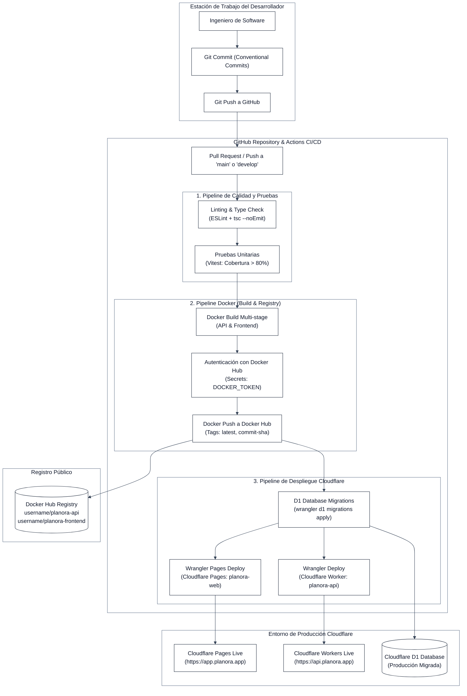

# Estrategia y Flujo de Despliegue Continuo (CI/CD) — Planora

**Herramienta de Orquestación:** GitHub Actions  
**Registro de Contenedores:** Docker Hub  
**Plataforma de Despliegue:** Cloudflare (Workers & Pages)  
**Herramienta de Despliegue en el Borde:** Cloudflare Wrangler CLI  

---

## 1. Aclaración Fundamental sobre la Arquitectura de Despliegue

> [!IMPORTANT]
> **Diferenciación Técnica Clave:**  
> **Cloudflare Workers NO ejecuta contenedores Docker en tiempo de ejecución.**  
> Cloudflare Workers opera sobre **V8 Isolates** nativos distribuidos en el Edge, lo que le permite iniciar en 0 milisegundos sin la sobrecarga de un sistema operativo contenedorizado.
> 
> **¿Por qué se utiliza Docker y Docker Hub en este proyecto?**
> 1. **Entorno de Compilación y Pruebas 100% Reproducible:** Docker aísla las dependencias del sistema operativo, garantizando que los tests de Vitest y las compilaciones de TypeScript se ejecuten exactamente igual en la máquina del desarrollador y en los agentes de GitHub Actions.
> 2. **Cumplimiento de Estándares de Infraestructura de la Asignatura:** Satisface los requisitos de entrega de la materia *Infraestructura para el Desarrollo Continuo*, empaquetando los artefactos del backend y frontend como imágenes OCI versionadas y publicadas en Docker Hub.
> 3. **Portabilidad y Despliegues Alternativos:** Facilita la ejecución de la plataforma en entornos on-premise, servidores locales de evaluación docente o nubes alternativas en caso de requerirse.

---

## 2. Diagrama de Pipeline de Deployment (Mermaid)



---

## 3. Especificación del Pipeline de GitHub Actions

El archivo `.github/workflows/ci-cd.yml` implementa el flujo automatizado:

```yaml
name: Planora CI/CD Pipeline

on:
  push:
    branches: [main, develop]
  pull_request:
    branches: [main, develop]

env:
  DOCKER_ORG: ${{ secrets.DOCKERHUB_USERNAME }}
  API_IMAGE: planora-api
  FRONTEND_IMAGE: planora-frontend

jobs:
  # ========================================================
  # ETAPA 1: LINTING, TYPE CHECK Y PRUEBAS UNITARIAS
  # ========================================================
  quality-and-tests:
    name: Code Quality & Unit Tests
    runs-on: ubuntu-latest
    steps:
      - name: Checkout del Repositorio
        uses: actions/checkout@v4

      - name: Configurar Node.js LTS (v20)
        uses: actions/setup-node@v4
        with:
          node-version: 20
          cache: 'npm'

      - name: Instalar Dependencias del Monorepo
        run: npm ci

      - name: Verificación Estática de Tipos (TypeScript)
        run: npm run typecheck

      - name: Análisis de Código Estático (ESLint)
        run: npm run lint

      - name: Ejecución de Pruebas Unitarias (Vitest)
        run: npm run test:coverage

      - name: Publicar Reporte de Cobertura
        uses: actions/upload-artifact@v4
        with:
          name: test-coverage-report
          path: coverage/

  # ========================================================
  # ETAPA 2: DOCKER BUILD & PUBLICACIÓN EN DOCKER HUB
  # ========================================================
  docker-hub-publish:
    name: Docker Build & Push to Docker Hub
    needs: quality-and-tests
    runs-on: ubuntu-latest
    if: github.ref == 'refs/heads/main' && github.event_name == 'push'
    steps:
      - name: Checkout del Repositorio
        uses: actions/checkout@v4

      - name: Configurar Docker Buildx
        uses: actions/setup-buildx-action@v3

      - name: Login en Docker Hub
        uses: docker/login-action@v3
        with:
          username: ${{ secrets.DOCKERHUB_USERNAME }}
          password: ${{ secrets.DOCKERHUB_TOKEN }}

      - name: Extraer Metadata de Tags
        id: meta
        uses: docker/metadata-action@v5
        with:
          images: |
            ${{ secrets.DOCKERHUB_USERNAME }}/${{ env.API_IMAGE }}
            ${{ secrets.DOCKERHUB_USERNAME }}/${{ env.FRONTEND_IMAGE }}

      - name: Construir y Publicar Imagen Docker del Backend (API)
        uses: docker/build-push-action@v5
        with:
          context: .
          file: ./docker/Dockerfile.api
          push: true
          tags: |
            ${{ secrets.DOCKERHUB_USERNAME }}/${{ env.API_IMAGE }}:latest
            ${{ secrets.DOCKERHUB_USERNAME }}/${{ env.API_IMAGE }}:${{ github.sha }}

      - name: Construir y Publicar Imagen Docker del Frontend
        uses: docker/build-push-action@v5
        with:
          context: .
          file: ./docker/Dockerfile.frontend
          push: true
          tags: |
            ${{ secrets.DOCKERHUB_USERNAME }}/${{ env.FRONTEND_IMAGE }}:latest
            ${{ secrets.DOCKERHUB_USERNAME }}/${{ env.FRONTEND_IMAGE }}:${{ github.sha }}

  # ========================================================
  # ETAPA 3: DESPLIEGUE CONTINUO EN CLOUDFLARE
  # ========================================================
  cloudflare-deploy:
    name: Cloudflare Production Deployment
    needs: docker-hub-publish
    runs-on: ubuntu-latest
    if: github.ref == 'refs/heads/main' && github.event_name == 'push'
    steps:
      - name: Checkout del Repositorio
        uses: actions/checkout@v4

      - name: Configurar Node.js
        uses: actions/setup-node@v4
        with:
          node-version: 20
          cache: 'npm'

      - name: Instalar Dependencias
        run: npm ci

      - name: Aplicar Migraciones D1 a Producción
        run: npx wrangler d1 migrations apply planora-d1-prod --remote
        env:
          CLOUDFLARE_API_TOKEN: ${{ secrets.CLOUDFLARE_API_TOKEN }}
          CLOUDFLARE_ACCOUNT_ID: ${{ secrets.CLOUDFLARE_ACCOUNT_ID }}

      - name: Desplegar Cloudflare Worker (API)
        uses: cloudflare/wrangler-action@v3
        with:
          apiToken: ${{ secrets.CLOUDFLARE_API_TOKEN }}
          accountId: ${{ secrets.CLOUDFLARE_ACCOUNT_ID }}
          command: deploy

      - name: Compilar Frontend React para Producción
        run: npm run build --workspace=packages/frontend

      - name: Desplegar Cloudflare Pages (Frontend)
        uses: cloudflare/pages-action@v1
        with:
          apiToken: ${{ secrets.CLOUDFLARE_API_TOKEN }}
          accountId: ${{ secrets.CLOUDFLARE_ACCOUNT_ID }}
          projectName: 'planora-web'
          directory: 'packages/frontend/dist'
```
