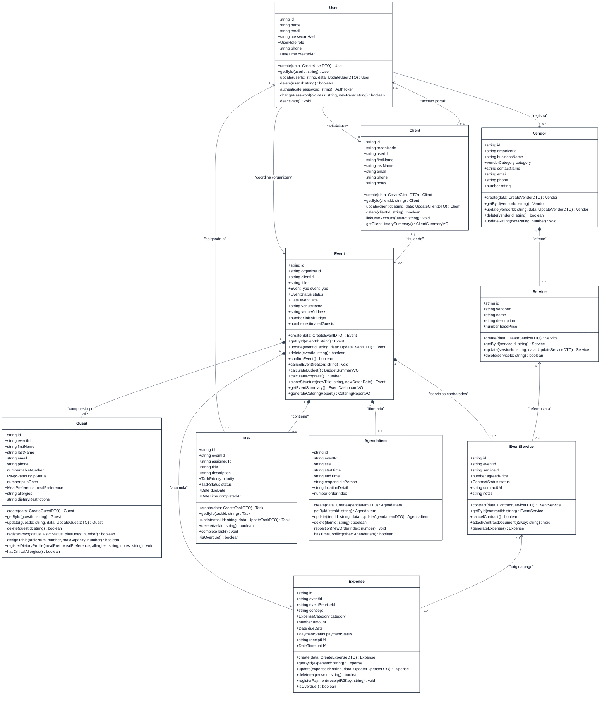
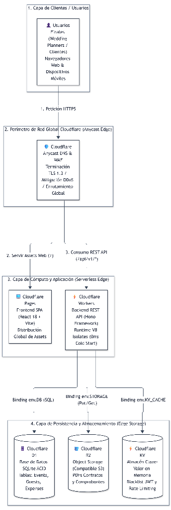
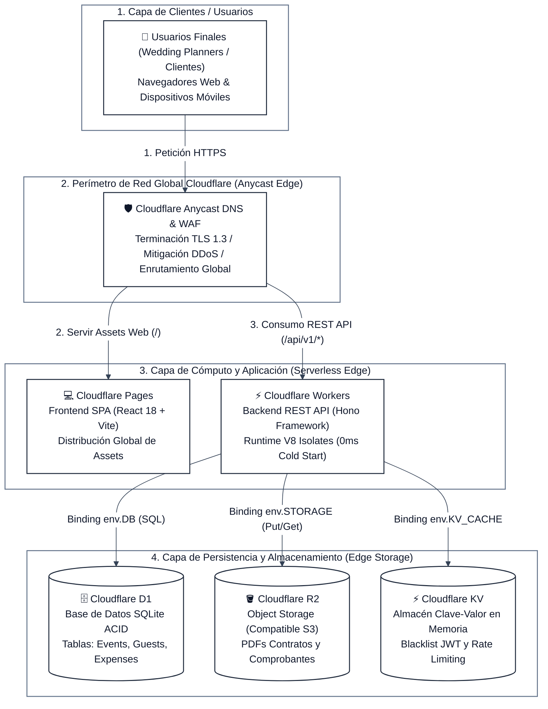
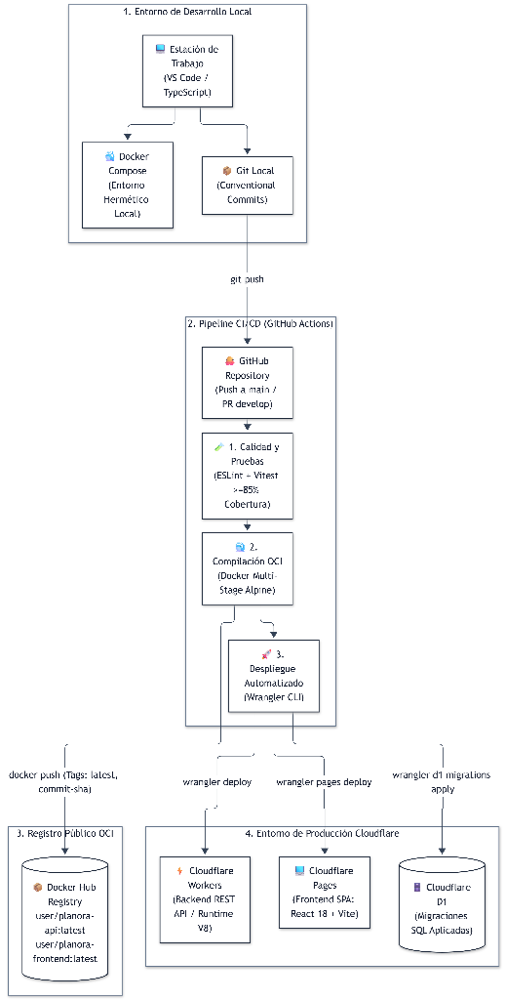
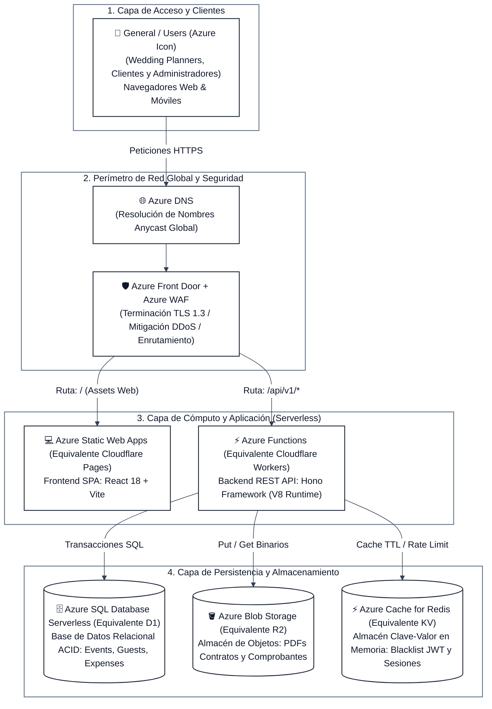
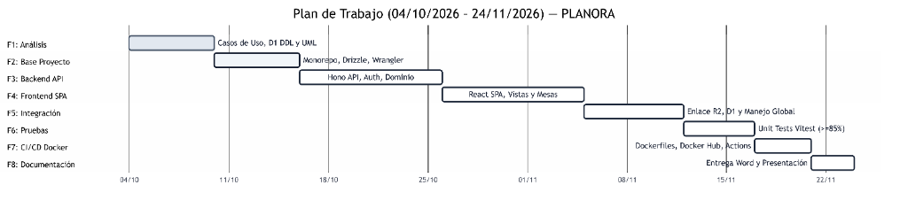
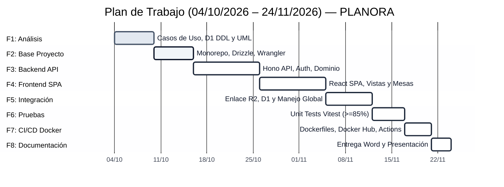
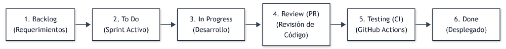
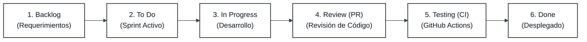

# PLANORA: Plataforma Integral de Gestión Operativa, Gastronómica y Financiera para Organizadores de Eventos

**Asignatura:** Infraestructura para el Desarrollo Continuo (9º Semestre)  
**Tipo de Documento:** Propuesta y Especificación Técnica de Proyecto de Grado / Proyecto Final  
**Nombre del Sistema:** **PLANORA**  

---

# 1. Título del Proyecto

### **PLANORA: Plataforma Integral de Gestión Operativa, Gastronómica y Financiera para Organizadores Profesionales de Eventos**

#### Justificación del Nombre:
El nombre **PLANORA** nace de la convergencia conceptual entre *Planning* (planificación metódica, orden y logística rigurosa) y *Aura* (la atmósfera, esencia y distinción única que caracteriza a cada celebración). 

Es una marca corta (3 sílabas), fonéticamente armónica, memorable y de alcance internacional. A diferencia de nombres excesivamente nupciales o informales, PLANORA proyecta una identidad neutra y profesional aplicable con la misma solidez a bodas, fiestas de XV años, galas de graduación, aniversarios y congresos corporativos.

> **Lema Oficial:** *"PLANORA: Tu centro de control operativo para eventos extraordinarios."*

---

# 2. Descripción del Proyecto

**PLANORA** es una solución de software web desarrollada bajo el modelo *Software as a Service* (SaaS) orientada al segmento B2B, diseñada para convertirse en el **centro de control operativo, logístico y financiero** de personas y agencias dedicadas profesionalmente a la organización de eventos (tales como *wedding planners*, coordinadores sociales y organizadores de eventos corporativos).

El sistema responde a una necesidad crítica de la industria: los coordinadores de eventos administran celebraciones de alto impacto emocional y económico donde un solo error en el conteo de comensales, una mesa sobrepasada en su capacidad física, una alergia alimentaria no notificada a la cocina o una desviación en los pagos de proveedores puede arruinar el evento o generar severas pérdidas financieras.

**PLANORA** no es una plataforma pública para descubrir fiestas ni una boletera de venta masiva de entradas al estilo de Eventbrite o Ticketmaster. Su propósito es actuar como la **herramienta de gestión interna del organizador**, permitiéndole:
1. Administrar el ciclo de vida completo de múltiples eventos de forma simultánea.
2. Mantener un control exacto de la lista de invitados, confirmaciones de asistencia (RSVP) y distribución de mesas.
3. Centralizar las preferencias gastronómicas de los comensales y emitir alertas preventivas sobre alergias alimentarias críticas para el equipo de catering.
4. Monitorear el presupuesto acordado frente a los gastos reales mediante alertas de semáforo preventivas.
5. Gestionar la contratación de proveedores y la custodia de contratos y comprobantes en formato digital.
6. Coordinar el cronograma del "minuto a minuto" del día del evento garantizando que no existan colisiones de horarios entre proveedores.

---

# 3. Problemática y Justificación

### 3.1 Problemática Identificada
Como parte de una exploración inicial con una persona con experiencia práctica en la coordinación y producción de eventos, se identificaron los siguientes puntos de dolor operativos:

1. **Gestión de Invitados y Conteo de Asistentes:**  
   En eventos sociales como bodas y graduaciones resulta muy complejo llevar el conteo exacto de personas confirmadas, declinadas y acompañantes (+1s). Cualquier error en esta cifra deriva en cobros excesivos por cubiertos no utilizados o, en el peor de los casos, falta de asientos el día del evento.
2. **Distribución y Aforo de Mesas:**  
   Asignar manualmente a decenas o cientos de invitados en mesas respetando su capacidad física máxima y afinidades familiares/sociales es una tarea laboriosa propensa a sobrecupos de último minuto.
3. **Alimentación y Asignación de Menús:**  
   Es complicado determinar con exactitud qué platillo corresponde a cada persona una vez sentada en su mesa (menú regular, menú infantil, vegetariano, vegano, kosher), provocando confusiones y demoras en el servicio de los meseros.
4. **Alergias y Restricciones Médicas Críticas:**  
   Representa un punto de alto riesgo para la seguridad física de los invitados. No contar con un registro riguroso de alergias severas (mariscos, frutos secos, celiaquía/gluten, lactosa) puede desencadenar emergencias médicas y demandas legales si la cocina no recibe indicaciones precisas por mesa.
5. **Gestión de Bebidas:**  
   Coordinar insumos y cantidades de bebidas (barra libre, destilados por mesa, descorche, bebidas sin alcohol) suele generar dudas en las compras o desabasto durante las horas pico de la fiesta.
6. **Coordinación de Transporte:**  
   Cuando el organizador asume la logística de traslados (autobuses, camionetas para comitivas, traslados entre templo y salón), coordinar horarios, capacidades de vehículos y puntos de reunión incrementa considerablemente la carga de trabajo.
7. **Dispersión de la Información (Hipótesis Inicial de Trabajo):**  
   Se plantea como hipótesis que los organizadores gestionan actualmente estos procesos recurriendo a múltiples herramientas separadas (hojas de cálculo en Excel, conversaciones y confirmaciones informales por WhatsApp, y minutas o contratos en Google Drive), lo que provoca información desactualizada y falta de trazabilidad.

### 3.2 Justificación Técnica y de Negocio
La concurrencia de estas problemáticas demuestra que los aspectos logísticos más críticos comparten un sujeto común: **el asistente al evento**. Centralizar en una plataforma web la relación entre invitados, mesas, menús, alergias, cronogramas y presupuesto permite al organizador mitigar riesgos humanos, eliminar la duplicación de datos y brindar reportes consolidados inmediatos tanto al cliente como al proveedor del banquete.

Desplegar esta solución sobre la infraestructura Serverless de **Cloudflare** (Pages, Workers, D1, R2 y KV) proporciona ventajas estratégicas:
- **Latencia mínima (<50 ms):** El organizador y sus coordinadores en campo consultan datos en tiempo real desde sus teléfonos móviles sin demoras de red.
- **Cero mantenimiento de servidores:** Se elimina la carga de aprovisionar y parchar máquinas virtuales o contenedores permanentes en la nube.
- **Costos operativos prácticamente nulos:** Ideal para un modelo SaaS emergente y perfectamente sustentable como proyecto universitario individual.

### 3.3 Delimitación de Alcance: MVP vs. Funcionalidades Futuras
Para garantizar la viabilidad y excelencia técnica de un desarrollo individual de 9º semestre, se define una frontera estricta entre el MVP y versiones posteriores:

- **En el Alcance del MVP:**
  - Núcleo de invitados (RSVP, acompañantes, aforo y asignación de mesas).
  - Asignación de menús por comensal y registro de alergias con emisión del **Reporte Oficial para Catering**.
  - Ciclo de vida del evento y gestión de clientes.
  - Conciliación de presupuestos, registro de gastos y semáforo financiero (Verde, Amarillo, Rojo).
  - Directorio de proveedores, contratación de servicios y archivo digital de contratos/comprobantes en Cloudflare R2.
  - Tablero de tareas operativas y cronograma minuto a minuto con validación de choques horarios.
  - Bebidas y transporte cubiertos de forma pragmática como servicios contratados, tareas y partidas presupuestarias.
- **Diferido a Funcionalidades Futuras (Post-MVP):**
  - Módulo de logística de flotas en tiempo real (asignación de asientos en buses, tracking GPS y pases de abordar QR).
  - Calculadora predictiva de botellas de licor y control de mermas/descorche en almacén.
  - Pasarelas bancarias de cobro en vivo (Stripe) para venta masiva de boletos.
  - Aplicación móvil nativa compilada para tiendas de apps (el MVP es una web SPA 100% responsiva).

---

# 4. Componentes y Funcionalidades

El sistema está compuesto por 10 módulos altamente cohesivos y desacoplados:

### 1. Componente de Usuarios (`UserComponent`)
- **Propósito:** Autenticación de identidad, seguridad y autorización basada en roles (RBAC).
- **Datos Principales:** `id`, `name`, `email`, `password_hash`, `role` (`admin`, `organizer`, `client`), `phone`, `timestamps`.
- **Operaciones CRUD:** `createUser()`, `getUserById()`, `updateUser()`, `deleteUser()`.
- **Métodos de Negocio:**
  - `authenticate(email, password)`: Valida credenciales, comprueba estado activo y genera token JWT firmado mediante Web Crypto API.
  - `changePassword(userId, oldPass, newPass)`: Valida la robustez y actualiza el hash seguro.
  - `deactivateUser(userId)`: Suspende accesos de forma lógica preservando el historial.

### 2. Componente de Clientes (`ClientComponent`)
- **Propósito:** Administración de anfitriones y empresas contratantes.
- **Datos Principales:** `id`, `organizer_id`, `user_id` (opcional), `first_name`, `last_name`, `email`, `phone`, `notes`.
- **Operaciones CRUD:** `createClient()`, `getClientById()`, `getClientsByOrganizer()`, `updateClient()`, `deleteClient()`.
- **Métodos de Negocio:**
  - `linkUserAccount(clientId, userId)`: Habilita el acceso del cliente al portal de consulta.
  - `getClientHistorySummary(clientId)`: Genera el consolidado histórico de eventos y volumen económico contratado.

### 3. Componente de Eventos (`EventComponent`)
- **Propósito:** Agregado raíz del sistema. Coordina el ciclo de vida y la logística central.
- **Datos Principales:** `id`, `organizer_id`, `client_id`, `title`, `event_type`, `status` (`draft`, `planning`, `confirmed`, `in_progress`, `completed`, `cancelled`), `event_date`, `venue_name`, `venue_address`, `initial_budget`, `estimated_guests`.
- **Operaciones CRUD:** `createEvent()`, `getEventById()`, `listEvents()`, `updateEvent()`, `deleteEvent()`.
- **Métodos de Negocio:**
  - `confirmEvent(eventId)`: Valida que la fecha sea futura, el presupuesto sea $\ge 0$ y exista un cliente titular antes de transicionar a `confirmed`.
  - `cancelEvent(eventId, reason)`: Desactiva en cascada tareas pendientes y congela la agenda.
  - `calculateEventProgress(eventId)`: Computa el porcentaje ponderado de avance ($0\% - 100\%$) basado en tareas completadas.
  - `cloneEventStructure(sourceEventId, newTitle, newDate)`: Clona tareas base y cronograma para reutilizarlos como plantilla.

### 4. Componente de Invitados y Gastronomía (`GuestComponent`)
- **Propósito:** Control de asistentes, confirmaciones (RSVP), mesas, menús y alergias.
- **Datos Principales:** `id`, `event_id`, `first_name`, `last_name`, `email`, `phone`, `table_number`, `rsvp_status` (`pending`, `confirmed`, `declined`), `plus_ones`, `meal_preference` (`standard`, `vegetarian`, `vegan`, `child`, `kosher`, `other`), `allergies`, `dietary_restrictions`.
- **Operaciones CRUD:** `addGuest()`, `getGuestById()`, `listGuestsByEvent()`, `updateGuest()`, `removeGuest()`.
- **Métodos de Negocio:**
  - `registerRsvp(guestId, status, confirmedPlusOnes)`: Actualiza confirmación y valida límite de acompañantes.
  - `assignTable(guestId, tableNumber, maxCapacity)`: Evalúa algorítmicamente que la suma de personas en la mesa no sobrepase su aforo máximo.
  - `registerDietaryProfile(guestId, mealPref, allergies, notes)`: Sella las preferencias gastronómicas y advertencias médicas.
  - `generateCateringDietaryReport(eventId)`: Emite un informe estructurado para el chef/banquetero desglosando: (a) total de platillos por tipo de menú, (b) distribución de comensales por mesa, y (c) alertas críticas de alergias severas geolocalizadas por mesa.
  - `calculateRsvpMetrics(eventId)`: Retorna totales de invitados, confirmados, declinados y porcentaje de asistencia.

### 5. Componente de Proveedores (`VendorComponent`)
- **Propósito:** Directorio y evaluación de empresas externas prestadoras de servicios.
- **Datos Principales:** `id`, `organizer_id`, `business_name`, `category` (`catering`, `photography`, `music_dj`, `venue`, `decoration`, `transport`, `other`), `contact_name`, `email`, `phone`, `rating`.
- **Operaciones CRUD:** `createVendor()`, `getVendorById()`, `listVendors()`, `updateVendor()`, `deleteVendor()`.
- **Métodos de Negocio:**
  - `updateRating(vendorId, newRating)`: Calcula la calificación promedio histórica (escala 1.0 a 5.0).

### 6. Componente de Servicios y Contrataciones (`EventServiceComponent`)
- **Propósito:** Formalización de contrataciones entre eventos y servicios de proveedores.
- **Datos Principales:** `id`, `event_id`, `service_id`, `agreed_price`, `status` (`quoted`, `contracted`, `paid`, `cancelled`), `contract_url`, `notes`.
- **Operaciones CRUD:** `contractService()`, `getContractById()`, `listContractsByEvent()`, `cancelContract()`.
- **Métodos de Negocio:**
  - `attachContractDocument(contractId, r2Key)`: Enlaza el archivo digital del contrato en Cloudflare R2.
  - `generateExpense(contractId)`: Crea automáticamente el registro presupuestario con el monto pactado en estado `pending`.

### 7. Componente de Presupuesto y Gastos (`BudgetComponent` / `ExpenseComponent`)
- **Propósito:** Control financiero exhaustivo, pagos y conciliación presupuestaria.
- **Datos Principales:** `id`, `event_id`, `event_service_id` (opcional), `concept`, `category`, `amount`, `due_date`, `payment_status` (`pending`, `partial`, `paid`), `receipt_url`, `paid_at`.
- **Operaciones CRUD:** `recordExpense()`, `getExpenseById()`, `listExpensesByEvent()`, `updateExpense()`, `deleteExpense()`.
- **Métodos de Negocio:**
  - `calculateBudgetStatus(eventId)`: Computa:
    $$\text{Balance} = \text{Presupuesto Inicial} - \sum \text{Gastos Registrados}$$
  - `checkBudgetOverrunAlert(eventId)`: Determina el semáforo financiero: Verde ($<90\%$), Amarillo ($90\%-99\%$) o Rojo ($\ge 100\%$ sobrecosto).
  - `registerPayment(expenseId, receiptR2Key)`: Transiciona el gasto a `paid`, sella la fecha `paid_at` y vincula el comprobante digital en Cloudflare R2.

### 8. Componente de Tareas Operativas (`TaskComponent`)
- **Propósito:** Checklist y seguimiento de actividades logísticas con plazos de vencimiento.
- **Datos Principales:** `id`, `event_id`, `assigned_to`, `title`, `description`, `priority` (`low`, `medium`, `high`, `urgent`), `status` (`todo`, `in_progress`, `completed`), `due_date`, `completed_at`.
- **Operaciones CRUD:** `createTask()`, `getTaskById()`, `listTasksByEvent()`, `updateTask()`, `deleteTask()`.
- **Métodos de Negocio:**
  - `completeTask(taskId)`: Cambia el estado a `completed`, registra `completed_at` y actualiza el avance general del evento.
  - `getOverdueTasks(eventId)`: Detecta actividades no completadas cuya fecha límite sea anterior a hoy.

### 9. Componente de Agenda y Cronograma (`AgendaComponent`)
- **Propósito:** Coordinación del itinerario del "minuto a minuto" durante el día del evento.
- **Datos Principales:** `id`, `event_id`, `title`, `start_time`, `end_time`, `responsible_person`, `location_detail`, `notes`, `order_index`.
- **Operaciones CRUD:** `addAgendaItem()`, `getAgendaItemById()`, `listAgendaByEvent()`, `updateAgendaItem()`, `deleteAgendaItem()`.
- **Métodos de Negocio:**
  - `reorderTimeline(eventId, orderedItemIds)`: Recalcula y persiste el índice de ordenamiento (`order_index`).
  - `detectTimeConflicts(eventId)`: Algoritmo que compara intervalos $[t_{start}, t_{end}]$ y emite alertas ante solapamientos en la misma locación o con el mismo responsable.

### 10. Componente de Dashboard Ejecutivo (`DashboardComponent`)
- **Propósito:** Consultas agregadas y analítica operativa para el organizador.
- **Métodos de Negocio:**
  - `getOrganizerOverview(organizerId)`: Agrega eventos activos, monto total administrado y tareas críticas por vencer en una sola consulta SQL optimizada en D1.

---

# 5. Diagrama UML de Clases

A continuación se presenta el modelo orientado a objetos del dominio de **PLANORA** generado en Mermaid UML, reflejando entidades, atributos tipados, operaciones CRUD y métodos de lógica de negocio:



---

# 6. Stack Tecnológico

El stack tecnológico ha sido cuidadosamente seleccionado bajo la premisa de **eficiencia en el borde (Edge Computing), tipado estricto de extremo a extremo y cero sobrecarga de servidores**:

| Tecnología | Rol en el Proyecto | ¿Por qué se utiliza? | ¿Qué parte del proyecto resuelve? |
|---|---|---|---|
| **React 18 + TypeScript + Vite** | Frontend SPA | Ecosistema maduro, compilación ultrarrápida con Vite y tipado estricto. | Interfaz de usuario dinámica para gestión de mesas, comensales y cronogramas. |
| **Tailwind CSS** | Framework de Estilos | Estilos utilitarios sin peso muerto en bundle y alta velocidad de desarrollo visual. | Diseño profesional y consistente del dashboard con soporte para dispositivos móviles. |
| **Hono** | Backend API Framework | Microframework (<15 KB) optimizado nativamente para V8 Isolates de Cloudflare Workers. | Enrutamiento veloz, validación de esquemas Zod y middleware de autenticación JWT. |
| **Cloudflare Workers** | Cómputo Serverless Backend | Tiempos de arranque en frío de 0 ms y ejecución en más de 300 centros de datos globales. | Ejecuta la API sin pagar servidores ni lidiar con clústeres permanentes. |
| **Cloudflare D1** | Base de Datos Relacional | Motor SQLite transaccional serverless integrado en la red de Cloudflare. | Almacenamiento ACID de usuarios, eventos, comensales, tareas y finanzas. |
| **Drizzle ORM** | Capa de Mapeo Relacional | ORM tipado con TypeScript con cero sobrecarga en tiempo de ejecución. | Consultas seguras y generación automática de migraciones SQL para D1. |
| **Cloudflare R2** | Almacenamiento de Objetos | Compatible con la API de Amazon S3 sin costos de transferencia saliente (*zero egress*). | Custodia de contratos de proveedores en PDF y fotografías de comprobantes de pago. |
| **Cloudflare KV** | Almacén Clave-Valor | Acceso en memoria con latencia <15 ms distribuido globalmente. | Lista negra de tokens JWT revocados (*logout*) y control de tasa de peticiones. |
| **Vitest** | Framework de Testing | Compatible de forma nativa con ESM y TypeScript; rápida ejecución paralela. | Pruebas unitarias de la lógica matemática de presupuestos y aforo de mesas. |
| **Git & GitHub** | Control de Versiones | Estándar global de gestión de código fuente colaborativo. | Trazabilidad del desarrollo, revisión de Pull Requests y ramas de trabajo. |
| **GitHub Actions** | Automatización CI/CD | Orquestador de integración continua integrado nativamente en GitHub. | Ejecución automatizada de pruebas, linter, builds y despliegues sin intervención manual. |
| **Docker & Docker Hub** | Contenedores y Registro OCI | Construcción multi-stage de imágenes y registro público de artefactos. | Entorno de build y pruebas 100% reproducible y cumplimiento con la rúbrica académica. |

---

# 7. Diagrama de Infraestructura

> [!NOTE]
> **Aclaración de Arquitectura:**  
> Cloudflare Workers **NO ejecuta contenedores Docker en tiempo de ejecución**; se ejecuta sobre **V8 Isolates** nativos. Docker se utiliza en el pipeline de desarrollo y CI/CD para compilar y probar la aplicación en un entorno idéntico y publicar las imágenes en Docker Hub para cumplir los requerimientos de la materia.

### 7.1 Diagrama de Infraestructura Cloud en Producción (Cloudflare Native)

El siguiente diagrama representa de forma limpia, simétrica y vertical la arquitectura física y de red en el entorno de producción de **Cloudflare**, mostrando el flujo ordenado de solicitudes desde el usuario hasta la capa de persistencia en el Edge:



<details>
<summary><b>Ver código fuente Mermaid del Diagrama de Infraestructura</b></summary>


</details>

---

### 7.2 Diagrama del Ciclo de Vida DevOps y Despliegue Continuo (CI/CD)

Para evitar cruces de líneas y mantener una representación simétrica e intuitiva, el flujo de desarrollo, pruebas, publicación en **Docker Hub** y despliegue a **Cloudflare** se estructura en un pipeline continuo:

```mermaid
%%{init: {
  'theme': 'base',
  'themeVariables': {
    'primaryColor': '#ffffff',
    'primaryBorderColor': '#1e293b',
    'primaryTextColor': '#0f172a',
    'lineColor': '#334155',
    'secondaryColor': '#ffffff',
    'tertiaryColor': '#ffffff',
    'mainBkg': '#ffffff',
    'nodeBorder': '#1e293b',
    'nodeTextColor': '#0f172a',
    'clusterBkg': '#ffffff',
    'clusterBorder': '#64748b',
    'clusterTextColor': '#0f172a',
    'titleColor': '#0f172a',
    'edgeLabelBackground': '#ffffff'
  }
}}%%
flowchart LR
    %% ETAPA 1: DESARROLLO
    subgraph DEV["1. Desarrollo Local"]
        DevStation["💻 Estación de Trabajo\n(VS Code / TypeScript)"]
        GitRepo["📦 Git Local\n(Conventional Commits)"]
        DockerEnv["🐳 Docker Compose\n(Entorno Hermético)"]
        DevStation --> GitRepo
        DevStation --> DockerEnv
    end

    %% ETAPA 2: CI EN GITHUB ACTIONS
    subgraph CICD["2. CI/CD (GitHub Actions)"]
        GitHub["🐙 GitHub Repo\n(Ramas: main / develop)"]
        TestStage["🧪 Vitest Tests & Lint\n(Cobertura >= 85%)"]
        DockerStage["🐳 Docker Build\n(Multi-Stage Alpine)"]
        GitHub --> TestStage --> DockerStage
    end

    %% ETAPA 3: REGISTRO DOCKER HUB
    subgraph REGISTRY["3. Registro OCI"]
        DockerHub[("📦 Docker Hub\nuser/planora-api\nuser/planora-frontend")]
    end

    %% ETAPA 4: DESPLIEGUE CLOUDFLARE
    subgraph DEPLOY["4. Despliegue Producción"]
        WranglerCLI["🚀 Wrangler CLI\n(IaC Automatizado)"]
        CloudflareEdge["🌐 Cloudflare Live\n(Workers API + Pages UI)"]
        WranglerCLI --> CloudflareEdge
    end

    %% Conexiones entre etapas
    GitRepo -->|"git push"| GitHub
    DockerStage -->|"docker push"| DockerHub
    DockerStage -->|"Dispara Despliegue"| WranglerCLI

    %% Estilos de Nodos en Color Blanco Puro
    classDef whiteNode fill:#ffffff,stroke:#1e293b,stroke-width:1.5px,color:#0f172a;
    class DevStation,GitRepo,DockerEnv,GitHub,TestStage,DockerStage,DockerHub,WranglerCLI,CloudflareEdge whiteNode;

    style DEV fill:#ffffff,stroke:#64748b,stroke-width:1.5px,color:#0f172a
    style CICD fill:#ffffff,stroke:#64748b,stroke-width:1.5px,color:#0f172a
    style REGISTRY fill:#ffffff,stroke:#64748b,stroke-width:1.5px,color:#0f172a
    style DEPLOY fill:#ffffff,stroke:#64748b,stroke-width:1.5px,color:#0f172a
```



<details>
<summary><b>Ver código fuente Mermaid del Diagrama de Deployment</b></summary>


</details>

---

### 7.3 Diagrama de Infraestructura con Servicios e Íconos de Azure (Cumplimiento de Rúbrica)

Para cumplir con el criterio de evaluación docente (*"Recursos: Diagrama de infraestructura, usando los iconos de Azure"*), a continuación se presenta la homologación exacta de la arquitectura de **PLANORA** mapeada a los servicios equivalentes del catálogo de **Microsoft Azure Architecture Icons**:



#### Tabla de Equivalencias y Recursos Homologados con Azure:

| Componente de PLANORA | Recurso Cloudflare | Ícono Equivalente Azure | Propósito y Rol en el Sistema |
|---|---|---|---|
| **Usuarios / Acceso** | Navegadores Web/Móvil | `General / Users` | Wedding Planners y anfitriones interactuando con la plataforma. |
| **Frontend Web** | Cloudflare Pages | `Azure Static Web Apps` | Hospedaje y distribución global de la SPA React 18 + Vite. |
| **DNS y Enrutamiento** | Cloudflare Anycast DNS | `Azure DNS` | Resolución de nombres con latencia mínima en el borde. |
| **Seguridad Perimetral** | Cloudflare WAF & DDoS | `Azure Web Application Firewall (WAF)` | Inspección de paquetes, mitigación de ataques y terminación TLS. |
| **Cómputo Serverless** | Cloudflare Workers | `Azure Functions` | Ejecución de la API REST de Hono con tiempo de arranque en frío de 0 ms. |
| **Base de Datos** | Cloudflare D1 (SQLite) | `Azure SQL Database Serverless` | Persistencia relacional ACID para usuarios, eventos, comensales y gastos. |
| **Almacenamiento Objetos**| Cloudflare R2 | `Azure Blob Storage` | Custodia de contratos PDF de proveedores y comprobantes fotográficos. |
| **Caché y Sesiones** | Cloudflare KV | `Azure Cache for Redis` | Almacén en memoria para revocación inmediata de JWT y control de peticiones. |

---

### 7.4 Estrategia de Registro y Publicación en Docker Hub

Para cumplir con el estándar de infraestructura y reproducibilidad hermética, el proyecto empaqueta sus componentes como imágenes OCI estandarizadas y las publica de forma automatizada en **Docker Hub**:

- **Organización y Nombres de Repositorio:**
  - `docker.io/<usuario>/planora-api`: Imagen multi-stage basada en `node:20-alpine` conteniendo el backend de Hono compilado y optimizado.
  - `docker.io/<usuario>/planora-frontend`: Imagen basada en `nginx:alpine` conteniendo los assets estáticos de React 18 precompilados por Vite.
- **Estrategia de Etiquetado (*Tagging*):**
  - `latest`: Representa la versión estable más reciente integrada en la rama `main`.
  - `<commit-sha>` (ej. `sha-7a8b9c0`): Garantiza inmutabilidad y trazabilidad para auditorías docentes y despliegues reproducibles.
  - `v1.0.0`: Versiones semánticas (*Semantic Versioning*) asociadas a cada Release oficial.
- **Automatización CI/CD:**  
  El workflow de GitHub Actions se autentica contra Docker Hub mediante secretos cifrados (`DOCKER_USERNAME` y `DOCKER_TOKEN`), compila las imágenes en paralelo y ejecuta el push únicamente tras la aprobación de todas las pruebas unitarias.

---

### 7.5 Estrategia de Ramas Git y Flujo de Trabajo

Se implementa un modelo de **Git Flow Adaptado y Pragmático**, balanceando el máximo rigor de control de versiones con la agilidad requerida para un desarrollo individual:

- **Ramas Troncales Protegidas:**
  - `main`: Código productivo 100% probado. Protegida contra *direct pushes*; únicamente recibe cambios mediante *Pull Requests* aprobados desde `develop` o ramas `hotfix/*`.
  - `develop`: Rama de integración activa donde convergen las nuevas funcionalidades terminadas.
- **Ramas Efímeras de Trabajo:**
  - `feature/<issue-id>-<slug>` (ej. `feature/06-event-lifecycle`): Creadas desde `develop` para desarrollar un Issue específico.
  - `fix/<issue-id>-<slug>`: Corrección de defectos detectados durante las pruebas en CI.
  - `hotfix/<slug>`: Correcciones urgentes de producción originadas desde `main`.
- **Convención de Mensajes (Conventional Commits v1.0.0):**
  - Formato: `<tipo>(<alcance>): <descripción>` (ej. `feat(budget): add overage warning calculation`).
  - Tipos admitidos: `feat`, `fix`, `docs`, `style`, `refactor`, `test`, `chore`.
- **Integración Obligatoria por Pull Request:**
  - Ningún código se fusiona sin pasar los *Status Checks* de GitHub Actions (Linter ESLint, verificación de tipos TypeScript y $\ge 85\%$ de cobertura en pruebas Vitest).

---

---

# 8. Plan de Trabajo

El desarrollo del proyecto se organiza en **8 Fases de Ingeniería** secuenciales y lógicas:



<details>
<summary><b>Ver código fuente Mermaid del Diagrama de Gantt</b></summary>


</details>

### Detalle de Fases (Calendario Oficial: 04/10/2026 al 24/11/2026):
- **Fase 1 — Análisis y Diseño (04/10/2026 – 10/10/2026):**  
  *Objetivo:* Formalizar requisitos, modelo relacional D1 y diseño de clases UML.  
  *Entregables:* DDL SQL de D1, especificación de casos de uso y diagramas UML.  
  *Dependencias:* Ninguna.
- **Fase 2 — Base del Proyecto (10/10/2026 – 16/10/2026):**  
  *Objetivo:* Configurar monorepo, tooling (TypeScript, ESLint, Wrangler) y esquemas Drizzle.  
  *Entregables:* Repositorio base con build tipado sin errores.  
  *Dependencias:* Fase 1.
- **Fase 3 — Backend API y Dominio (16/10/2026 – 26/10/2026):**  
  *Objetivo:* Desarrollar API REST con Hono y servicios de dominio (`EventService`, `GuestService`, `BudgetService`).  
  *Entregables:* Endpoints REST funcionales en local con Miniflare.  
  *Dependencias:* Fase 2.
- **Fase 4 — Frontend SPA (26/10/2026 – 05/11/2026):**  
  *Objetivo:* Construir la interfaz de usuario en React 18, Vite y Tailwind CSS.  
  *Entregables:* Pantallas de Dashboard, Eventos, Invitados (con asignación de mesas, menús y alergias) y Finanzas.  
  *Dependencias:* Fase 3.
- **Fase 5 — Integración y Motor Financiero (05/11/2026 – 12/11/2026):**  
  *Objetivo:* Conectar el frontend con el backend y validar subida de contratos y comprobantes a Cloudflare R2.  
  *Entregables:* Flujo end-to-end probado en desarrollo local.  
  *Dependencias:* Fase 4.
- **Fase 6 — Pruebas Unitarias y Calidad (12/11/2026 – 17/11/2026):**  
  *Objetivo:* Desarrollar suites de pruebas unitarias en Vitest para lógica financiera, RSVP y choques de agenda.  
  *Entregables:* Reporte de cobertura $\ge 85\%$ en servicios de dominio.  
  *Dependencias:* Fase 5.
- **Fase 7 — CI/CD y Docker (17/11/2026 – 21/11/2026):**  
  *Objetivo:* Automatizar construcción multi-stage de imágenes Docker, publicación en Docker Hub y despliegue a Cloudflare.  
  *Entregables:* Imágenes públicas en Docker Hub y pipeline de GitHub Actions en verde.  
  *Dependencias:* Fase 6.
- **Fase 8 — Documentación Final y Cierre (21/11/2026 – 24/11/2026):**  
  *Objetivo:* Consolidar el documento final para Word, preparar diapositivas ejecutivas y guion de defensa.  
  *Entregables:* Documento final, diapositivas y repositorio listo para entrega.  
  *Dependencias:* Fase 7.

---

# 9. Pruebas del Sistema (Estrategia y Especificación de Casos de Prueba)

### 9.1 Estrategia de Aseguramiento de Calidad
El aseguramiento de calidad de **PLANORA** se fundamenta en pruebas automatizadas ejecutadas sobre el motor de ejecución de pruebas **Vitest** (compatible nativamente con TypeScript y módulos ESM en el entorno de Cloudflare Workers). 

La estrategia prioriza la verificación de la **capa de dominio y lógica de negocio pura** bajo el paradigma de *Clean Architecture*. De este modo, los algoritmos críticos (cálculos financieros, asignación de aforos de mesas, segregación de dietas médicas y detección de conflictos de agenda) son evaluados de forma aislada en memoria, sin incurrir en dependencias lentas de red o bases de datos físicas, garantizando una ejecución ultrarrápida (<2 segundos) tanto en desarrollo local como en el pipeline de Integración Continua (CI) en GitHub Actions.

- **Meta de Cobertura de Código:** $\ge 85\%$ en servicios de dominio y reglas de negocio; $\ge 75\%$ a nivel global.
- **Criterio de Aceptación:** El 100% de los casos de prueba deben finalizar en estado exitoso (*Passing*) previo a la integración de ramas o despliegues productivos.

---

### 9.2 Descripción Detallada de Casos de Prueba

#### Caso de Prueba 1: Conciliación Financiera y Semáforo de Presupuesto (`CP-FIN-01`)
- **Módulo / Componente:** `BudgetCalculator` / `ExpenseService` (Módulo de Presupuesto y Gastos).
- **Propósito:** Validar que el motor financiero compute con precisión el balance remanente, el porcentaje ejecutado de inversión y la activación del semáforo preventivo de sobrecosto conforme a los umbrales de negocio establecidos.
- **Precondiciones:** Evento registrado con un presupuesto base pactado con el cliente.
- **Escenarios de Prueba Evaluados:**
  1. **Escenario 1.1 — Margen Seguro (Semáforo Verde):**  
     *Entrada:* Presupuesto inicial de \$100,000 MXN; gastos registrados y confirmados por \$45,000 MXN.  
     *Ejecución:* El servicio calcula el balance remanente y el porcentaje ejecutado (\$55,000 MXN restantes, 45.0% consumido).  
     *Resultado Esperado:* Estado del semáforo en `verde` y bandera de sobrecosto inactiva (`isOverrun = false`).
  2. **Escenario 1.2 — Alerta Preventiva (Semáforo Amarillo):**  
     *Entrada:* Presupuesto inicial de \$100,000 MXN; gastos registrados acumulados por \$92,000 MXN.  
     *Ejecución:* El consumo alcanza el 92.0%, sobrepasando el umbral preventivo del 90%.  
     *Resultado Esperado:* Estado del semáforo en `amarillo`, bandera `isOverrun = false`, y generación de advertencia visual para restringir nuevas contrataciones no planificadas.
  3. **Escenario 1.3 — Sobrecosto Crítico (Semáforo Rojo):**  
     *Entrada:* Presupuesto inicial de \$50,000 MXN; gastos registrados por \$55,000 MXN.  
     *Ejecución:* El gasto total rebasa el 100% pactado (110.0% consumido, balance deficitario de -\$5,000 MXN).  
     *Resultado Esperado:* Estado del semáforo en `rojo`, activación inmediata de la bandera de sobrecosto (`isOverrun = true`) y emisión de alerta crítica de déficit presupuestal.
  4. **Escenario 1.4 — Validación Defensiva (Caso Borde de Presupuesto en Cero):**  
     *Entrada:* Evento sin presupuesto inicial asignado (\$0 MXN) que registra un gasto operativo imprevisto de \$1,500 MXN.  
     *Ejecución:* Algoritmo defensivo que previene divisiones por cero (`NaN` o `Infinity`).  
     *Resultado Esperado:* El balance refleja con precisión -\$1,500 MXN y activa el semáforo en `rojo` sin interrumpir la ejecución del sistema.

---

#### Caso de Prueba 2: Control de Aforo y Asignación de Mesas (`CP-MES-02`)
- **Módulo / Componente:** `GuestService` / `TableService` (Módulo de Invitados y Logística de Salón).
- **Propósito:** Comprobar que el algoritmo de distribución de salón respete estrictamente la capacidad física máxima de cada mesa, considerando tanto al invitado titular como a sus acompañantes confirmados (+1s).
- **Precondiciones:** Mesas del recinto dadas de alta con su capacidad nominal de sillas.
- **Escenarios de Prueba Evaluados:**
  1. **Escenario 2.1 — Asignación Válida con Acompañante:**  
     *Entrada:* Mesa #4 con capacidad máxima de 10 personas; actualmente ocupada por 6 personas. Se asigna a un invitado titular que confirmó 1 acompañante adicional (+1).  
     *Ejecución:* El sistema calcula la ocupación total resultante ($6 \text{ sentados} + 1 \text{ titular} + 1 \text{ acompañante} = 8 \text{ personas}$).  
     *Resultado Esperado:* Asignación autorizada exitosamente (`true`), asociando al invitado a la mesa y actualizando el aforo ocupado a 8 comensales.
  2. **Escenario 2.2 — Rechazo por Sobrecupo:**  
     *Entrada:* Mesa #2 con capacidad máxima de 10 personas; ocupada actualmente por 9 personas. Se intenta asignar a un invitado que confirmó 2 acompañantes (+2).  
     *Ejecución:* El sistema detecta que la demanda excede el aforo disponible ($9 + 1 + 2 = 12 > 10$).  
     *Resultado Esperado:* Asignación rechazada (`false`), denegación de la operación en base de datos y emisión del error de validación `TableCapacityExceededError`.

---

#### Caso de Prueba 3: Gestión de Menús, Alergias y Reporte de Catering (`CP-CAT-03`)
- **Módulo / Componente:** `GuestService` / `CateringReportService` (Módulo de Invitados y Gastronomía).
- **Propósito:** Validar la captura fidedigna de preferencias alimentarias y la consolidación de advertencias médicas críticas para prevenir intoxicaciones o emergencias en el banquete.
- **Precondiciones:** Invitados registrados con confirmación de asistencia activa (RSVP = `confirmed`).
- **Escenarios de Prueba Evaluados:**
  1. **Escenario 3.1 — Registro y Sellado de Alergias Severas:**  
     *Entrada:* Invitado confirma asistencia, selecciona menú "Vegetariano" y documenta alergia médica severa a "Cacahuates / Frutos Secos (Riesgo de Choque Anafiláctico)".  
     *Ejecución:* La entidad de dominio valida y sella los datos, activando automáticamente el indicador de riesgo médico `hasCriticalAllergies = true`.  
     *Resultado Esperado:* Registro exitoso con etiquetado de alta prioridad médica vinculado permanentemente al número de mesa asignada al comensal.
  2. **Escenario 3.2 — Emisión del Reporte Oficial para Banquetero:**  
     *Entrada:* Lista de 150 comensales confirmados con diversas opciones de platillo (regular, vegano, kosher, infantil) y 4 comensales con alergias médicas críticas.  
     *Ejecución:* Se ejecuta el método agregador `generateCateringDietaryReport(eventId)`.  
     *Resultado Esperado:* Generación de un reporte estructurado que detalla: (a) consolidado total de platillos por menú para compra de insumos, (b) conteo de charolas requeridas por mesa, y (c) sección de alertas rojas médicas destacando Comensal, Mesa y Alérgeno prohibido.

---

#### Caso de Prueba 4: Agenda Minuto a Minuto y Detección de Conflictos Horarios (`CP-AGE-04`)
- **Módulo / Componente:** `AgendaService` (Módulo de Itinerario Operativo).
- **Propósito:** Verificar que el algoritmo de cronograma detecte empalmes o solapamientos de horario entre proveedores o actividades que compiten por el mismo espacio físico o por el mismo responsable.
- **Precondiciones:** Evento activo con actividades programadas con hora de inicio y hora de fin $[t_{inicio}, t_{fin}]$.
- **Escenarios de Prueba Evaluados:**
  1. **Escenario 4.1 — Itinerario Secuencial Válido:**  
     *Entrada:* Actividad A ("Vals de los Novios", 20:00 a 20:30, Pista Central) y Actividad B ("Apertura de Cena", 20:30 a 22:00, Salón Principal).  
     *Ejecución:* El comparador de intervalos evalúa que los rangos de tiempo sean disjuntos.  
     *Resultado Esperado:* Cero conflictos reportados (`conflicts.length = 0`), permitiendo guardar y publicar el itinerario oficial.
  2. **Escenario 4.2 — Detección Automática de Choque de Horarios:**  
     *Entrada:* Actividad A ("Show de Mariachi", 21:00 a 22:00, Pista Central) y Actividad B ("Show de Baile Sorpresa", 21:30 a 22:30, Pista Central).  
     *Ejecución:* El algoritmo detecta solapamiento en el mismo espacio físico ($\max(t_{inicio, A}, t_{inicio, B}) < \min(t_{fin, A}, t_{fin, B})$).  
     *Resultado Esperado:* Identificación inmediata del conflicto (`conflicts.length = 1`), especificando los IDs de las actividades en colisión y la locación en disputa.

---

#### Caso de Prueba 5: Seguridad, Autenticación y Autorización RBAC (`CP-SEC-05`)
- **Módulo / Componente:** `AuthService` / `RbacMiddleware` (Módulo de Usuarios y Seguridad).
- **Propósito:** Garantizar el aislamiento estricto de información entre organizadores (*Multitenancy*) y el cumplimiento de restricciones operativas según el rol del usuario autenticado.
- **Precondiciones:** Cuentas creadas para los tres roles del sistema (`admin`, `organizer`, `client`).
- **Escenarios de Prueba Evaluados:**
  1. **Escenario 5.1 — Autenticación y Emisión de Token JWT:**  
     *Entrada:* Credenciales legítimas de un organizador (correo y contraseña válida).  
     *Ejecución:* Verificación de hash con Web Crypto API y firma criptográfica HMAC-SHA256 del token con expiración a 8 horas.  
     *Resultado Esperado:* Token JWT generado correctamente, conteniendo el identificador de usuario y el rol `organizer`.
  2. **Escenario 5.2 — Restricción de Privilegios para Rol Cliente:**  
     *Entrada:* Petición HTTP POST hacia la ruta protegida de registro de gastos `/api/v1/events/{id}/expenses`, enviada con el token de un usuario con rol `client`.  
     *Ejecución:* El middleware de autorización intercepta la petición y valida la matriz de permisos RBAC.  
     *Resultado Esperado:* Acceso denegado con código HTTP `403 Forbidden`, impidiendo que el cliente modifique presupuestos o contratos que corresponden exclusivamente al organizador.
  3. **Escenario 5.3 — Revocación de Sesión Inmediata (Logout via Cloudflare KV):**  
     *Entrada:* Usuario cierra sesión y se envía su token JWT vigente al endpoint de invalidación.  
     *Ejecución:* El identificador único del token (`jti`) se inserta en Cloudflare KV con clave `blacklist:<jti>` y un tiempo de vida (TTL) idéntico al remanente del token.  
     *Resultado Esperado:* Cualquier petición posterior utilizando ese mismo token es rechazada automáticamente con código HTTP `401 Unauthorized`.

---

### 9.3 Matriz de Trazabilidad y Resumen de Pruebas

| Identificador | Módulo del Sistema | Escenario Evaluado | Tipo de Prueba | Criterio de Aceptación |
|:---:|:---|:---|:---:|:---|
| **CP-FIN-01** | Presupuesto y Gastos | Balance seguro, preventivo y sobrecosto | Unitaria / Valores Límite | Transición exacta del semáforo (Verde, Amarillo, Rojo) y balance matemático exacto. |
| **CP-MES-02** | Invitados y Salón | Aforo de mesas con comensal + acompañantes | Unitaria / Regla de Negocio | Bloqueo absoluto de asignaciones que sobrepasen la capacidad máxima de sillas. |
| **CP-CAT-03** | Invitados y Catering | Registro de alergias y reporte de banquete | Unitaria / Integración | Desglose fiel de platillos y alertas médicas críticas visibles por número de mesa. |
| **CP-AGE-04** | Agenda y Cronograma | Itinerario secuencial y detección de choques | Unitaria / Algorítmica | Identificación de empalmes temporales y espaciales en la misma locación. |
| **CP-SEC-05** | Usuarios y Seguridad | Token JWT, matriz RBAC y revocación KV | Integración / Seguridad | Aislamiento de privilegios (403 a clientes) e invalidación efectiva de sesiones. |

---

# 10. GitHub Project Board y Plan de Trabajo

### 10.1 Estructura del Tablero Kanban (6 Columnas)



<details>
<summary><b>Ver código fuente Mermaid del flujo Kanban</b></summary>


</details>

Flujo textual lineal:
```text
[ BACKLOG ] ──> [ TODO ] ──> [ IN PROGRESS ] ──> [ REVIEW (PR) ] ──> [ TESTING (CI) ] ──> [ DONE ]
```

### 10.2 Relación de Milestones (10 Hitos del Proyecto)
- **M1:** Setup del Monorepo y Herramientas Base.
- **M2:** Base de Datos D1 y Esquemas Drizzle.
- **M3:** Autenticación JWT y Roles RBAC.
- **M4:** Módulo Core (Eventos, Clientes, Invitados y Mesas).
- **M5:** Motor Financiero, Gastronómico y Operativo.
- **M6:** Pruebas Unitarias Automatizadas en Vitest.
- **M7:** Containerización con Docker Multi-stage.
- **M8:** Pipeline CI/CD en GitHub Actions y Docker Hub.
- **M9:** Despliegue en Producción a Cloudflare Workers y Pages.
- **M10:** Documentación Final y Preparación de la Defensa.

### 10.3 Backlog de 23 Issues Accionables

| # Issue | Título del Issue | Milestone | Prioridad | Dependencias |
|:-------:|------------------|:---------:|:---------:|:------------:|
| **#01** | Setup del Monorepo, TypeScript, ESLint y Wrangler | M1 | Crítica | Ninguna |
| **#02** | Esquema Relacional D1 y Migraciones con Drizzle ORM | M2 | Crítica | #01 |
| **#03** | Módulo de Autenticación JWT y Roles RBAC (`admin`, `organizer`, `client`) | M3 | Alta | #02 |
| **#04** | Revocación de Tokens (Logout) y Rate Limiting con Cloudflare KV | M3 | Media | #03 |
| **#05** | CRUD de Clientes y Aislamiento Multitenant por Organizador | M4 | Alta | #03 |
| **#06** | Módulo de Eventos y Máquina de Estados del Ciclo de Vida | M4 | Crítica | #05 |
| **#07** | Módulo de Invitados, Confirmación RSVP y Aforo de Mesas | M4 | Alta | #06 |
| **#08** | Directorio de Proveedores y Catálogo de Servicios Base | M5 | Media | #03 |
| **#09** | Contratación de Servicios (`event_services`) y Almacenamiento en Cloudflare R2 | M5 | Alta | #06, #08 |
| **#10** | Motor de Presupuesto, Gastos y Semáforo de Sobrecosto | M5 | Crítica | #06, #09 |
| **#11** | Tablero de Tareas y Cálculo Dinámico de Progreso Porcentual | M5 | Alta | #06 |
| **#12** | Cronograma Minuto a Minuto con Detección de Conflictos Horarios | M5 | Alta | #06 |
| **#13** | Endpoints del Dashboard Ejecutivo de Métricas y KPIs | M5 | Media | #10, #11, #12 |
| **#14** | Frontend: Setup de React 18, Vite, Tailwind CSS y Enrutamiento Protegido | M4 | Alta | #03 |
| **#15** | Frontend: Vistas de Dashboard, Detalle de Evento y Presupuesto | M5 | Alta | #13, #14 |
| **#16** | Suite Integral de Pruebas Unitarias con Vitest ($\ge 85\%$ Dominio) | M6 | Crítica | #10, #11, #12 |
| **#17** | Dockerización del Backend con Dockerfile Multi-Stage y Healthcheck | M7 | Alta | #01, #16 |
| **#18** | Dockerización del Frontend con Nginx Alpine y Docker Compose Local | M7 | Alta | #15, #17 |
| **#19** | Configuración de Pipeline CI en GitHub Actions (Lint, Types, Tests) | M8 | Crítica | #16 |
| **#20** | Automatización de Construcción y Push a Docker Hub | M8 | Crítica | #17, #18, #19 |
| **#21** | Automatización de Despliegue a Cloudflare Workers y Pages con Wrangler | M9 | Crítica | #20 |
| **#22** | Documentación Técnica de Arquitectura y Especificación en Wiki | M10 | Alta | Todas |
| **#23** | Elaboración de Guion y Estructura de Diapositivas de Presentación | M10 | Alta | #22 |

---

# 11. Conclusión

El proyecto **PLANORA** representa una propuesta de ingeniería de software sólida, rigurosa y realizable individualmente por un estudiante de 9º semestre. 

A diferencia de proyectos teóricos desconectados de la realidad, **PLANORA** se sustenta en una problemática empírica validada mediante exploración inicial con una persona dedicada a la organización de eventos, resolviendo con precisión matemática y operativa los mayores dolores de cabeza de la profesión: el conteo de invitados, la asignación de mesas, la prevención de riesgos por alergias alimentarias y el control contra sobrecostos financieros.

La adopción de una arquitectura **Serverless Edge nativa en Cloudflare** combinada con **Clean Architecture** garantiza que el sistema sea extremadamente rápido (<50 ms de latencia), altamente seguro, económico de operar y completamente testeable de forma automatizada mediante Vitest, GitHub Actions y Docker Hub.

### Criterios de Éxito del Proyecto:
1. Emisión exitosa del **Reporte Oficial para Catering** con segregación de menús y alertas médicas de alergias por mesa.
2. Conciliación presupuestaria exacta con activación del semáforo financiero en tiempo real.
3. Cobertura de pruebas unitarias superior al 85% en la capa de servicios de dominio.
4. Pipeline de CI/CD automatizado que compila imágenes multi-stage para Docker Hub y despliega continuamente en Cloudflare Pages y Workers sin fallas.
