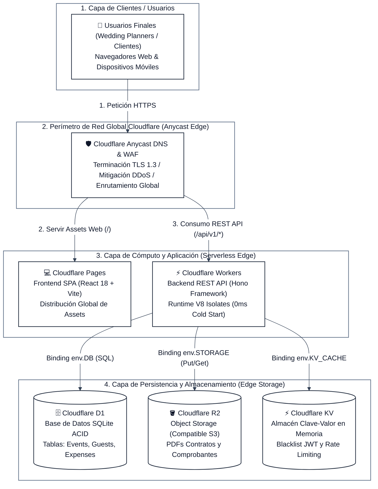

# Diagrama y Especificación de Infraestructura Cloud — Planora

**Proveedor Cloud Principal:** Cloudflare  
**Herramienta de Aprovisionamiento e IaC:** Wrangler CLI (`wrangler.toml`)  
**Modelo de Red:** Global Anycast Edge Network con terminación TLS automática  

---

## 1. Diagrama de Infraestructura Cloud en Producción (Cloudflare Native)



---

## 2. Diagrama del Ciclo de Vida DevOps y Despliegue Continuo (CI/CD)

```mermaid
%%{init: {
  'theme': 'base',
  'themeVariables': {
    'primaryColor': '#ffffff',
    'primaryBorderColor': '#1e293b',
    'primaryTextColor': '#0f172a',
    'lineColor': '#334155',
    'secondaryColor': '#ffffff',
    'tertiaryColor': '#ffffff',
    'mainBkg': '#ffffff',
    'nodeBorder': '#1e293b',
    'nodeTextColor': '#0f172a',
    'clusterBkg': '#ffffff',
    'clusterBorder': '#64748b',
    'clusterTextColor': '#0f172a',
    'titleColor': '#0f172a',
    'edgeLabelBackground': '#ffffff'
  }
}}%%
flowchart LR
    %% ETAPA 1: DESARROLLO
    subgraph DEV["1. Desarrollo Local"]
        DevStation["💻 Estación de Trabajo\n(VS Code / TypeScript)"]
        GitRepo["📦 Git Local\n(Conventional Commits)"]
        DockerEnv["🐳 Docker Compose\n(Entorno Hermético)"]
        DevStation --> GitRepo
        DevStation --> DockerEnv
    end

    %% ETAPA 2: CI EN GITHUB ACTIONS
    subgraph CICD["2. CI/CD (GitHub Actions)"]
        GitHub["🐙 GitHub Repo\n(Ramas: main / develop)"]
        TestStage["🧪 Vitest Tests & Lint\n(Cobertura >= 85%)"]
        DockerStage["🐳 Docker Build\n(Multi-Stage Alpine)"]
        GitHub --> TestStage --> DockerStage
    end

    %% ETAPA 3: REGISTRO DOCKER HUB
    subgraph REGISTRY["3. Registro OCI"]
        DockerHub[("📦 Docker Hub\nuser/planora-api\nuser/planora-frontend")]
    end

    %% ETAPA 4: DESPLIEGUE CLOUDFLARE
    subgraph DEPLOY["4. Despliegue Producción"]
        WranglerCLI["🚀 Wrangler CLI\n(IaC Automatizado)"]
        CloudflareEdge["🌐 Cloudflare Live\n(Workers API + Pages UI)"]
        WranglerCLI --> CloudflareEdge
    end

    %% Conexiones entre etapas
    GitRepo -->|"git push"| GitHub
    DockerStage -->|"docker push"| DockerHub
    DockerStage -->|"Dispara Despliegue"| WranglerCLI

    %% Estilos de Nodos en Color Blanco Puro
    classDef whiteNode fill:#ffffff,stroke:#1e293b,stroke-width:1.5px,color:#0f172a;
    class DevStation,GitRepo,DockerEnv,GitHub,TestStage,DockerStage,DockerHub,WranglerCLI,CloudflareEdge whiteNode;

    style DEV fill:#ffffff,stroke:#64748b,stroke-width:1.5px,color:#0f172a
    style CICD fill:#ffffff,stroke:#64748b,stroke-width:1.5px,color:#0f172a
    style REGISTRY fill:#ffffff,stroke:#64748b,stroke-width:1.5px,color:#0f172a
    style DEPLOY fill:#ffffff,stroke:#64748b,stroke-width:1.5px,color:#0f172a
```



---

## 3. Inventario Detallado de Recursos Cloudflare

A continuación se detalla cada recurso en la nube que compone la infraestructura de **Planora**:

### Recurso 1: Cloudflare Pages (`planora-web`)
- **Tipo de Recurso:** Plataforma de alojamiento JAMstack / SPA estática.
- **Propósito:** Hospeda y entrega los archivos HTML, CSS, JavaScript e imágenes compiladas de la aplicación frontend desarrollada en React.
- **Relación con otros recursos:** Es consumido por el navegador del usuario final. Las acciones del usuario dentro de la interfaz disparan peticiones AJAX/Fetch hacia el Cloudflare Worker de la API.
- **Aprovisionamiento:** Vinculado al repositorio de GitHub para despliegue continuo con la carpeta de salida `dist`.

### Recurso 2: Cloudflare Worker (`planora-api`)
- **Tipo de Recurso:** Cómputo serverless en el borde (*Edge Serverless Compute*).
- **Propósito:** Ejecuta el backend RESTful con el framework Hono. Centraliza la autenticación, la validación de peticiones y toda la lógica de negocio (presupuestos, eventos, invitados, tareas).
- **Relación con otros recursos:** Se comunica directamente con Cloudflare D1, R2 y KV mediante **Bindings de JavaScript nativos** inyectados en el contexto de ejecución (`env`), eliminando la necesidad de abrir sockets TCP manuales o exponer cadenas de conexión en texto plano.
- **Aprovisionamiento:** Declarado y desplegado mediante `wrangler deploy`.

### Recurso 3: Cloudflare D1 (`planora-d1-prod`)
- **Tipo de Recurso:** Base de datos relacional serverless basada en SQLite.
- **Propósito:** Almacena todos los datos estructurados del sistema: usuarios, clientes, eventos, contrataciones, gastos, tareas, invitados y cronogramas.
- **Relación con otros recursos:** Vinculado al Worker mediante el binding `env.DB`. Es operado a través de **Drizzle ORM** para ejecutar consultas SQL tipadas y transaccionales con garantías ACID.
- **Aprovisionamiento:** Creado vía `wrangler d1 create planora-d1-prod`.

### Recurso 4: Cloudflare R2 (`planora-assets-prod`)
- **Tipo de Recurso:** Almacén de objetos distribuido (*Object Storage*) compatible con Amazon S3 API.
- **Propósito:** Almacena de manera persistente y cifrada los archivos binarios: contratos de servicios firmados en PDF, comprobantes de pago escaneados e imágenes de referencia de los eventos.
- **Relación con otros recursos:** Vinculado al Worker mediante el binding `env.STORAGE`. Los archivos se suben y se descargan mediante URLs prefirmadas o streaming directo del Worker, sin incurrir en costos de transferencia saliente (*zero egress fees*).
- **Aprovisionamiento:** Creado vía `wrangler r2 bucket create planora-assets-prod`.

### Recurso 5: Cloudflare KV (`planora-kv-prod`)
- **Tipo de Recurso:** Almacén clave-valor distribuido globalmente de baja latencia (*Key-Value Store*).
- **Propósito:** 
  1. Lista negra de tokens JWT revocados (*token revocation blacklist*) para invalidar sesiones al hacer logout.
  2. Almacenamiento de contadores para control de tasa de peticiones (*rate limiting*) por dirección IP.
- **Relación con otros recursos:** Vinculado al Worker mediante el binding `env.KV_CACHE`.
- **Aprovisionamiento:** Creado vía `wrangler kv:namespace create planora-kv-prod`.

---

## 3. Configuración Declarativa de Infraestructura (`wrangler.toml`)

El siguiente archivo define formalmente la infraestructura como código (IaC) para el Worker de backend:

```toml
name = "planora-api"
main = "src/index.ts"
compatibility_date = "2024-09-23"
compatibility_flags = ["nodejs_compat"]

# Variables de entorno públicas
[vars]
ENVIRONMENT = "production"
API_VERSION = "v1"

# 1. BINDING A BASE DE DATOS CLOUDFLARE D1
[[d1_databases]]
binding = "DB"
database_name = "planora-d1-prod"
database_id = "d1-uuid-planora-production-001"

# 2. BINDING A STORAGE DE OBJETOS CLOUDFLARE R2
[[r2_buckets]]
binding = "STORAGE"
bucket_name = "planora-assets-prod"

# 3. BINDING A CACHÉ CLOUDFLARE KV
[[kv_namespaces]]
binding = "KV_CACHE"
id = "kv-uuid-planora-production-001"

# Configuración de Observabilidad y Logs
[observability]
enabled = true
head_sampling_rate = 1.0
```
