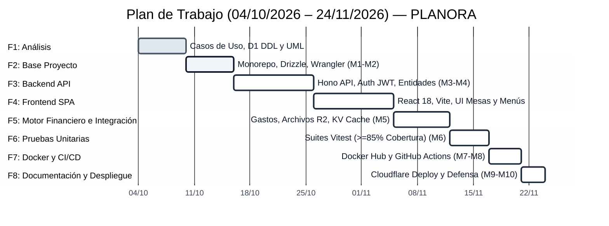

# Plan de Trabajo, Milestones y Gestión del Proyecto — Planora

**Metodología:** Ágil / Kanban Adaptado para Desarrollo Individual  
**Herramienta de Gestión:** GitHub Projects v2  
**Ciclo de Entrega:** 9 Fases de Ingeniería alineadas a 10 Milestones evaluables  

---

## 1. Estructura del Tablero (GitHub Project Board)

El tablero de GitHub Projects se configura con 6 columnas estandarizadas de flujo continuo:

```text
+-----------+--------+---------------+----------+-----------+--------+
|  BACKLOG  |  TODO  |  IN PROGRESS  |  REVIEW  |  TESTING  |  DONE  |
+-----------+--------+---------------+----------+-----------+--------+
| Tareas no | Listas | Rama de       | Pull     | Pruebas   | Merge  |
| activas o | para   | trabajo       | Request  | unitarias | a main |
| futuras   | iniciar| activa        | abierto  | en CI     | y en   |
|           | en el  | (feature/*)   | para     | exitosas  | prod   |
|           | sprint |               | revisión |           |        |
+-----------+--------+---------------+----------+-----------+--------+
```

### Reglas de Movimiento de Tarjetas:
1. **TODO $\rightarrow$ IN PROGRESS:** El desarrollador crea la rama `feature/<id>-<slug>` y se autoasigna la tarea.
2. **IN PROGRESS $\rightarrow$ REVIEW:** Se abre el Pull Request contra `develop` vinculando el Issue con la sintaxis `Closes #ID`.
3. **REVIEW $\rightarrow$ TESTING:** El PR está listo y se disparan los workflows automáticos de GitHub Actions (Linter, Typecheck y Vitest).
4. **TESTING $\rightarrow$ DONE:** Todos los checks del CI finalizan en verde y se aprueba el merge a la rama principal.

---

## 2. Definición de Milestones (Hitos del Proyecto)

| Milestone | Nombre del Hito | Entregables Clave |
|-----------|-----------------|-------------------|
| **M1** | Setup & Inicialización | Estructura de repositorio monorepo, TypeScript, ESLint, Wrangler y scripts base. |
| **M2** | Arquitectura y Modelo D1 | Esquema relacional con Drizzle ORM, migraciones SQL de D1 y validadores Zod. |
| **M3** | Autenticación y RBAC | Login, hashing seguro, emisión de JWT y verificación en KV con roles (`admin`, `organizer`, `client`). |
| **M4** | Módulo Core (Clientes & Eventos) | CRUD de clientes, ciclo de vida del evento (`EventEntity`) y gestión de invitados con RSVP. |
| **M5** | Motor Operativo y Financiero | Cálculo de presupuesto, conciliación de gastos, contratación de servicios y cronograma minuto a minuto. |
| **M6** | Testing & Aseguramiento de Calidad | Suite completa de pruebas con Vitest (cobertura $\ge 85\%$ en dominio) y mocks de Miniflare. |
| **M7** | Containerización con Docker | Dockerfiles multi-stage para backend y frontend, y archivo `docker-compose.yml` para ejecución local. |
| **M8** | CI/CD & Docker Hub Automation | Workflow de GitHub Actions con jobs de test, compilación y push automatizado de imágenes a Docker Hub. |
| **M9** | Despliegue en Cloudflare | Despliegue productivo de API en Cloudflare Workers y SPA en Cloudflare Pages con bindings a D1, R2 y KV. |
| **M10** | Documentación Final y Entrega | Wiki en GitHub con diagramas Mermaid, README institucional y estructura de presentación en diapositivas. |

---

## 3. Matriz de Fases de Trabajo y Relación con Milestones



### Detalle de Fases de Ingeniería (04/10/2026 al 24/11/2026):
- **Fase 1 — Análisis y Requisitos (04/10/2026 – 10/10/2026):** Identificación de actores, especificación de casos de uso y definición de reglas de negocio operativas.
- **Fase 2 — Setup y Base del Proyecto (10/10/2026 – 16/10/2026):** Modelado relacional en Cloudflare D1, configuración de Wrangler CLI y esquemas Drizzle.
- **Fase 3 — Backend API Core y Dominio (16/10/2026 – 26/10/2026):** Implementación de endpoints y servicios con Hono, autenticación JWT, clientes, eventos e invitados.
- **Fase 4 — Frontend SPA (26/10/2026 – 05/11/2026):** Construcción de la interfaz de usuario en React 18, Vite y Tailwind CSS (vistas de mesas, catering y presupuestos).
- **Fase 5 — Motor Financiero e Integración (05/11/2026 – 12/11/2026):** Conciliación presupuestaria, alertas de semáforo, contratos en Cloudflare R2 y sesiones en KV.
- **Fase 6 — Pruebas Unitarias y Calidad (12/11/2026 – 17/11/2026):** Suites con Vitest ($\ge 85\%$ cobertura en dominio) y validaciones de aforo y choques horarios.
- **Fase 7 — Containerización y CI/CD (17/11/2026 – 21/11/2026):** Dockerfiles multi-stage, publicación de imágenes en Docker Hub y pipeline de GitHub Actions.
- **Fase 8 — Documentación Final, Despliegue y Defensa (21/11/2026 – 24/11/2026):** Despliegue productivo en Cloudflare (Workers y Pages), entrega formal del documento Word y presentación ejecutiva.
